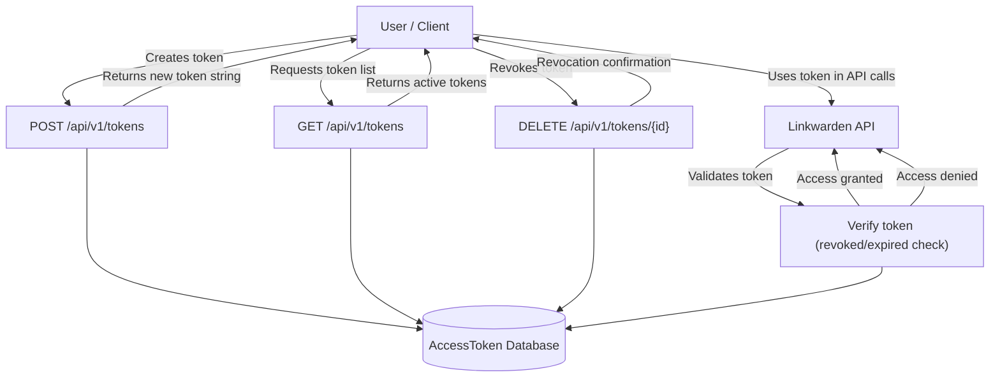

# API Tokens & Access Control

Manage your programmatic access to Linkwarden securely and efficiently by generating, revoking, and controlling API tokens. This page guides you through creating API tokens, understanding their scopes and restrictions, managing rate limits and quotas, and adopting best security practices for robust access control.

---

## Overview

API tokens enable automated, programmatic interactions with Linkwarden APIs without needing to use your primary user credentials. These tokens provide scoped access for integration with external tools, custom scripts, or third-party applications.

With API tokens, you can:

- Generate reusable tokens associated with your user account
- Assign meaningful names for easy identification
- Inspect token metadata including expiration and session status
- Revoke tokens instantly when compromised or no longer needed
- Comply with rate limits and usage quotas for fair system use

---

## Understanding API Tokens

Each API token is tied to a specific user and issued with security considerations: 

- **Token identity**: Uniquely identified via the `id` and `token` (internally stored securely).
- **Name**: User-assigned for identifying tokens (example: "CI Pipeline Access", "Mobile App Session").
- **Session vs API token**: Sessions represent active logins with expiration; API tokens are for automated use and can optionally expire.
- **Expiration**: Tokens can have long or short lifespans; expired tokens are rejected.
- **Revocation**: Tokens can be revoked explicitly to block any further use.


## API Token Lifecycle

### Creating a Token

To create a new API token:

1. Provide a meaningful `name` to recognize the token's purpose.
2. Optionally specify an expiration date for automatic expiry.
3. The server generates a cryptographically secure token string.
4. The token metadata is stored securely and a bearer token is returned.

### Listing Tokens

Retrieve all active tokens linked to your account for audit and management.

### Revoking Tokens

Revoke a token instantly to terminate its privileges:

- Useful in case of compromise.
- Removes the token from valid authentication checks.

---

## API Endpoints

All endpoints require authentication and enforce that tokens are linked to the authenticated user.

### List Tokens

- **Method:** `GET`
- **Path:** `/api/v1/tokens`
- **Description:** Retrieves all non-revoked API tokens associated with the authenticated user.
- **Response Fields:**
  - `id` (number): Unique token identifier
  - `name` (string): Token's friendly name
  - `isSession` (boolean): Indicates if this token is a session token
  - `expires` (ISO 8601 string or null): Expiration timestamp
  - `createdAt` (ISO 8601 string): Creation timestamp

#### Example Request
```http
GET /api/v1/tokens
Authorization: Bearer <your-valid-token>
```

#### Example Response
```json
{
  "response": [
    {
      "id": 123,
      "name": "CI Integration",
      "isSession": false,
      "expires": null,
      "createdAt": "2024-05-01T12:34:56Z"
    },
    {
      "id": 124,
      "name": "Web Session (Chrome)",
      "isSession": true,
      "expires": "2024-06-30T23:59:59Z",
      "createdAt": "2024-04-15T08:00:00Z"
    }
  ],
  "status": 200
}
```

---

### Create a New Token

- **Method:** `POST`
- **Path:** `/api/v1/tokens`
- **Description:** Generates a new API token for the authenticated user.
- **Request Body:** JSON containing:
  - `name` (string, required): Friendly name for the token.
  - `expires` (ISO 8601 string, optional): Expiration date of the token.

#### Example Request
```http
POST /api/v1/tokens
Content-Type: application/json
Authorization: Bearer <your-valid-token>

{
  "name": "Backup Script",
  "expires": "2025-01-01T00:00:00Z"
}
```

#### Example Response
```json
{
  "response": {
    "token": "eyJhbGciOiJIUzI1NiIsInR5cCI6IkpXVCJ9..."
  },
  "status": 200
}
```

**Note:** This returned token value is the only time it will be revealed. Store it securely.

---

### Revoke a Token

- **Method:** `DELETE`
- **Path:** `/api/v1/tokens/{id}`
- **Description:** Revokes an existing token by its ID, instantly invalidating further use.
- **Path Parameters:**
  - `id` (number): Identifier of the token to revoke

#### Example Request
```http
DELETE /api/v1/tokens/123
Authorization: Bearer <your-valid-token>
```

#### Example Response
```json
{
  "response": "Token revoked successfully.",
  "status": 200
}
```

---

## Authentication and Security

All API token operations require a valid user session or API token.

- Tokens are verified to ensure they are not revoked or expired before granting access.
- When a token is revoked or expired, the API responds with a 401 Unauthorized and a clear message.
- Session tokens (issued on login) are managed similarly.

### Best Practices for Secure Token Usage

- Use scoped tokens and avoid sharing tokens with broad permissions.
- Regenerate tokens periodically and revoke old ones immediately.
- Store tokens securely, using environment variables or secure vaults.
- Transmit tokens only over HTTPS to prevent interception.
- Monitor token usage and audit token lists frequently.

<Warning>
Never embed API tokens directly in publicly accessible code or repositories.
</Warning>

---

## Rate Limiting & Quotas

API tokens are subject to rate limiting to ensure system stability and fair usage:

- Each token has a defined quota for the number of requests per minute/hour.
- Exceeding the limit results in HTTP 429 Too Many Requests with a retry-after header.
- Design your integrations to handle throttling gracefully by backing off and retrying.

<Info>
Monitoring your token usage regularly helps prevent service disruptions and allows proactive adjustments.
</Info>

---

## Practical Workflows

### Common Use Case: Automating Backup Scripts

1. Generate a token named "Backup Script" with a suitable expiration.
2. Configure your script to authenticate API calls using the token in the `Authorization` header.
3. Programmatically retrieve, add, or update links as needed.
4. Revoke the token when the script is retired or compromised.

### Common Use Case: CI/CD Pipeline Integration

1. Create a dedicated token named "CI Pipeline Access" without an expiration or with a long-term expiration.
2. Store this token securely in your CI/CD environment variables.
3. Use it to automate link additions or integrations during builds.
4. Rotate tokens regularly to maintain security hygiene.

---

## Troubleshooting

### Common Issues

- **401 Unauthorized:** Check if your token is revoked or expired.
- **400 Bad Request:** Confirm request payloads match expected schema (e.g., valid `name` and `expires`).
- **429 Too Many Requests:** Your token exceeded rate limits; apply exponential backoff and retry.
- **Token Not Found on Revoke:** Confirm token ID belongs to your account; token IDs are unique per user.

### Tips

- Fetch your token list regularly to audit active tokens.
- Clearly label tokens to avoid losing track of their usage.
- Use short-lived tokens for increased security where possible.

---

## Code Examples

<CodeGroup>
```javascript
// List tokens example
async function listTokens() {
  const response = await fetch('/api/v1/tokens', {
    headers: { 'Authorization': 'Bearer YOUR_API_TOKEN' },
  });
  if (!response.ok) throw new Error('Failed to load tokens');
  const data = await response.json();
  console.log('Tokens:', data.response);
}
```

```python
import requests

def create_token(name, expires=None):
    url = 'https://your-linkwarden-instance/api/v1/tokens'
    headers = {'Authorization': f'Bearer YOUR_API_TOKEN', 'Content-Type': 'application/json'}
    payload = {"name": name}
    if expires:
        payload['expires'] = expires
    r = requests.post(url, json=payload, headers=headers)
    if r.status_code == 200:
        token = r.json()['response']['token']
        print('New token:', token)
    else:
        print('Error:', r.text)
```

```bash
# Revoke token example
curl -X DELETE \
  -H "Authorization: Bearer YOUR_API_TOKEN" \
  https://your-linkwarden-instance/api/v1/tokens/123
```
</CodeGroup>

---

## Summary

Managing API tokens securely ensures seamless and controlled programmatic access to Linkwarden. Always keep tokens confidential, monitor their usage, and revoke unused or compromised tokens immediately to maintain your data security and system reliability.

For additional integration support, review the related [Authentication & Authorization](../core-workflows/authentication-and-authorization), [User & Session Management](../core-workflows/user-management), and [Rate Limits & Usage Quotas](../integration-and-support/rate-limits-and-quotas) API documentation.

---

## Diagram: API Token Management Flow



---

## Additional Resources

- [Authentication & Authorization Guide](../core-workflows/authentication-and-authorization)
- [User & Session Management API](../core-workflows/user-management)
- [Rate Limits and Usage Quotas](../integration-and-support/rate-limits-and-quotas)
- [Managing Users and API Access Guide](../../../guides/advanced-tasks-and-best-practices/user-administration-tokens)

<Source url="https://github.com/linkwarden/linkwarden" paths={[{"path": "apps/web/pages/api/v1/tokens/index.ts", "range": "1-58"},{"path": "apps/web/pages/api/v1/tokens/[id].ts", "range": "1-30"},{"path": "apps/web/lib/api/controllers/tokens/getTokens.ts", "range": "1-24"}]} branch="main" />
