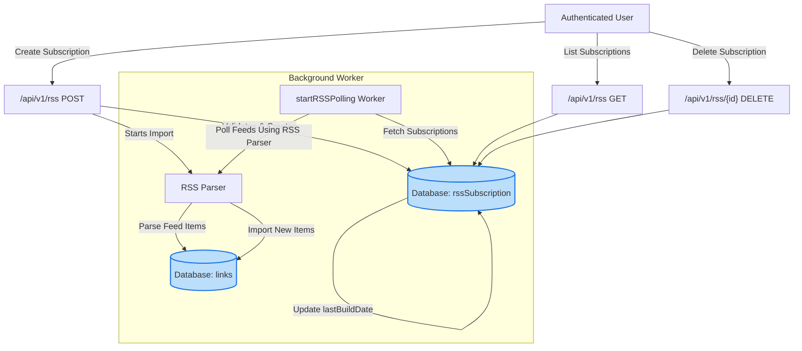

# RSS Feed Subscription Management API Reference

This documentation provides a complete guide to Linkwarden's RSS Feed Subscription Management API endpoints. It enables users to subscribe to RSS feeds, manage those subscriptions, and integrate automated polling to import new content as links directly into collections. Designed for staying updated with preferred sources and embedding content workflows, this guide covers key endpoints, request/response examples, data models, practical tips, and troubleshooting.

---

## 1. Overview

The RSS Feed Subscription Management API empowers users to programmatically handle RSS feed subscriptions within their Linkwarden accounts. This service automatically polls subscribed RSS feeds and imports new items as saved links, organized by collections.

- **Base Endpoint:** `/api/v1/rss`
- **Authentication:** Required (session or token-based via typical Linkwarden authentication)
- **Content-Type:** JSON for requests and responses
- **Rate Limits:** Follow general Linkwarden API guidelines (see [Rate Limits & Usage Quotas]( /api-reference/integration-and-support/rate-limits-and-quotas ))

### Primary Use Cases

- Creating and managing RSS feed subscriptions
- Automatic importing of feed items as Linkwarden links
- Associating imported links with specific collections
- Polling mechanism to keep content updated in the background

## 2. Authentication & Permissions

All endpoints require authenticated requests. The user must have permission to manage subscriptions and access the corresponding collections.

- If authentication fails, the API returns 401 Unauthorized
- Access to collections is verified before adding feeds

_Tip: Use your session or API tokens as per Linkwarden's [Authentication & Authorization guide]( /api-reference/core-workflows/authentication-and-authorization ) to securely authorize requests._

## 3. API Endpoints

### 3.1 List User RSS Subscriptions

Retrieve all RSS feed subscriptions for the authenticated user.

```
GET /api/v1/rss
Authorization: Bearer {token}
```

**Response:**
- HTTP 200 OK
- JSON body with an array of subscriptions, each including its `id`, `name`, `url`, and associated `collection.name`.

**Example JSON Response:**
```json
{
  "response": [
    {
      "id": 1,
      "name": "Tech News",
      "url": "https://tech.example.com/rss",
      "collection": { "name": "Tech Collection" }
    },
    {
      "id": 2,
      "name": "Science Daily",
      "url": "https://science.example.com/rss",
      "collection": { "name": "Research" }
    }
  ]
}
```

---

### 3.2 Create a New RSS Subscription

Subscribe to a new RSS feed and associate it with a collection. The API validates the subscription, checks quota limits, and immediately starts importing available feed items.

**Endpoint:**
```
POST /api/v1/rss
Content-Type: application/json
Authorization: Bearer {token}
```

**Request Body Parameters:**

| Field           | Type   | Description                                            |
|-----------------|--------|--------------------------------------------------------|
| `name`          | string | A unique name for the RSS subscription.                |
| `url`           | string | URL of the RSS feed to subscribe to.                   |
| `collectionId`  | number | (Optional) ID of an existing collection to link items.|
| `collectionName`| string | (Optional) Name of collection to create/use if ID missing.|

> One of `collectionId` or `collectionName` must be provided to specify where to save imported links.

**Response:**
- HTTP 200 OK with the created subscription details.
- HTTP 400 Bad Request if validation fails (e.g., invalid URL, missing fields, or duplicate subscription name).
- HTTP 403 Forbidden if the user has exceeded the subscription limit or lacks permission on the collection.

**Example Request:**
```json
{
  "name": "My Favorite Blog",
  "url": "https://example-blog.com/feed",
  "collectionName": "My Blog Collection"
}
```

**Successful Response Example:**
```json
{
  "response": {
    "id": 3,
    "name": "My Favorite Blog",
    "url": "https://example-blog.com/feed",
    "collection": {
      "name": "My Blog Collection"
    }
  }
}
```

**Important:** In a deployed **demo** environment (`NEXT_PUBLIC_DEMO=true`), creating subscriptions is disabled to prevent data modification.

---

### 3.3 Delete an Existing RSS Subscription

Remove a subscription and stop importing new RSS items. This action is permanent.

```
DELETE /api/v1/rss/{id}
Authorization: Bearer {token}
```
- Replace `{id}` with the subscription ID.

**Response:**
- HTTP 200 OK with a success message.
- HTTP 404 Not Found if subscription does not exist.
- HTTP 403 Forbidden if the user does not own the subscription.

**Example Response:**
```json
{
  "response": "RSS subscription deleted."
}
```

---

## 4. Data Model: RSS Subscription

Each subscription has the following key attributes:

| Field           | Type       | Description                                   |
|-----------------|------------|-----------------------------------------------|
| `id`            | integer    | Unique identifier for the subscription.       |
| `name`          | string     | Unique user-defined name for the subscription.|
| `url`           | string     | URL of the RSS feed.                           |
| `ownerId`       | integer    | User ID owning the subscription.               |
| `collectionId`  | integer    | ID of the collection where links are saved.   |
| `lastBuildDate` | DateTime?  | Timestamp of last processed feed update.      |

Relational associations:
- Each subscription belongs to a single user and a single collection.

## 5. How RSS Feed Polling Works

Linkwarden runs an internal background worker process that polls all user RSS subscriptions at a configured interval, fetching new items and importing them as links automatically.

- **Polling Interval:** Defaulted to 60 minutes, configurable via `NEXT_PUBLIC_RSS_POLLING_INTERVAL_MINUTES` environment variable.
- **Process:** 
  1. The worker fetches the latest RSS feed content using a standard RSS parser.
  2. Compares `lastBuildDate` or latest publication dates of feed items.
  3. Imports only new items published since the last update.
  4. Creates new links inside the associated collection.
  5. Updates the subscription's `lastBuildDate` timestamp.

<Tip>
This automated polling means once a subscription is created, your Linkwarden account stays updated with minimal manual intervention.
</Tip>

## 6. Practical Examples

### 6.1 Creating a Subscription via curl

```bash
curl -X POST "https://your-linkwarden-instance.com/api/v1/rss" \
  -H "Authorization: Bearer YOUR_TOKEN" \
  -H "Content-Type: application/json" \
  -d '{
        "name": "Hacker News",
        "url": "https://news.ycombinator.com/rss",
        "collectionName": "News"
      }'
```

### 6.2 Listing Subscriptions

```bash
curl -X GET "https://your-linkwarden-instance.com/api/v1/rss" \
  -H "Authorization: Bearer YOUR_TOKEN"
```

### 6.3 Deleting a Subscription

```bash
curl -X DELETE "https://your-linkwarden-instance.com/api/v1/rss/3" \
  -H "Authorization: Bearer YOUR_TOKEN"
```

## 7. Common Pitfalls & Troubleshooting

### 7.1 Subscription Limits Exceeded

- The system enforces a default limit (20 per user) on RSS subscriptions to control resource consumption.
- Attempting to create more subscriptions returns HTTP 403 with a descriptive error.
- **Solution:** Delete unused subscriptions or request limit adjustments if self-hosting.

### 7.2 Permission Denied Errors

- Occur if the user tries to subscribe with a collection they do not own or lack permissions for.
- Check collection ownership and access rights.

### 7.3 Invalid RSS URLs or Feed Format

- If the feed URL is invalid or unreachable, subscription creation is prevented.
- Errors may appear during import processing if feeds lack necessary date fields.
- **Tip:** Verify the RSS feed URL manually or via external validators.

### 7.4 Missing New Items on Polling

- The polling worker relies on `lastBuildDate` or `pubDate` fields from feeds.
- Feeds missing these may not trigger imports correctly.
- **Recommendation:** Use RSS sources following standard formatting.

### 7.5 Demo Environment Restrictions

- In a read-only demo environment, all POST and DELETE actions are disabled.
- Users receive an explicit message about disabled actions.

## 8. Best Practices

- Use clear, descriptive names for each subscription to keep your feed list organized.
- Group RSS subscriptions under collections related to topics or projects.
- Regularly review and prune expired or unused subscriptions to avoid hitting limits.
- Ensure your feed sources provide proper `pubDate` data for reliable import.
- Combine RSS subscription automation with manual bookmarking workflows for comprehensive link management.

## 9. Architecture Diagram: RSS Subscription Flow



## 10. Related Documentation

- [Authentication & Authorization]( /api-reference/core-workflows/authentication-and-authorization )
- [Collections API]( /api-reference/core-workflows/collections-api )
- [Managing Links]( /api-reference/core-workflows/managing-links )
- [RSS Feed Subscription User Guide]( /guides/automation-and-integrations/rss-feed-subscription )
- [Rate Limits & Usage Quotas]( /api-reference/integration-and-support/rate-limits-and-quotas )
- [Troubleshooting RSS Feeds]( /faq/integrations-and-support/troubleshooting-rss-feeds-and-automation )

---

## 11. Source Code References

For implementation details, see the following source files in the Linkwarden repository:

- [RSS Index API Handler](https://github.com/linkwarden/linkwarden/blob/main/apps/web/pages/api/v1/rss/index.ts)
- [RSS Subscription Delete API Handler](https://github.com/linkwarden/linkwarden/blob/main/apps/web/pages/api/v1/rss/[id].ts)
- [RSS Polling Worker](https://github.com/linkwarden/linkwarden/blob/main/apps/worker/workers/rssPolling.ts)
- [RSS Feed Processor](https://github.com/linkwarden/linkwarden/blob/main/packages/lib/rssHandler.ts)

---

This reference equips developers and integrators to fully leverage RSS feed subscriptions within Linkwarden, automating continuous content ingestion while maintaining organizational control through collections.


