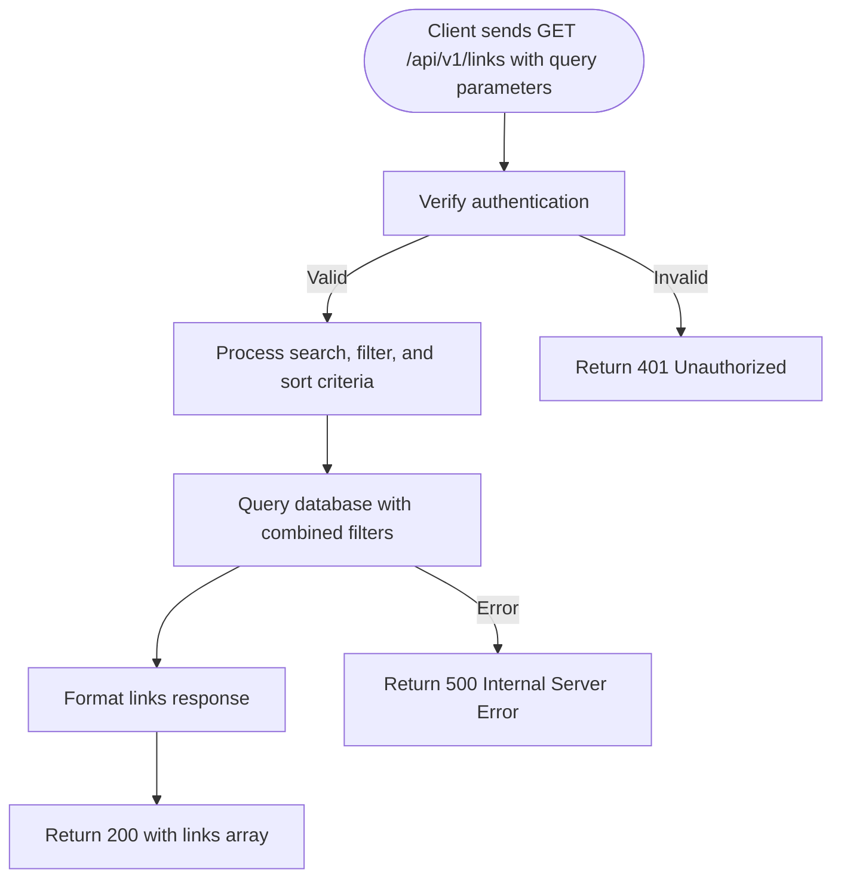

# Search, Filter & Sort API Reference

This documentation provides a comprehensive guide on using Linkwarden's powerful search, filtering, and sorting API capabilities to efficiently retrieve and organize your saved links across collections. Whether you want to perform full-text searches, filter by tags or collections, or sort results by date or name, this reference equips you with the parameters, examples, and best practices needed for optimal results.

---

## 1. Overview

The Search, Filter & Sort API enables clients to query saved links with advanced criteria, combining full-text search on multiple fields with tag and collection filters. Sorting options allow organizing results by creation date or name ascending/descending.

### Endpoint

```http
GET /api/v1/links
```

This endpoint returns a paginated, filtered list of links accessible by the authenticated user.

### Key Features

- Full-text search across link name, URL, description, and tags
- Filter by tag IDs or collection IDs
- Filter to show only pinned links
- Sort results by date or name in ascending or descending order
- Pagination support via cursor-based pagination


## 2. Authentication

All requests to this endpoint must be authenticated. Authentication is enforced via session tokens or API keys obtained through the core [Authentication & Authorization](https://linkwarden.com/api-reference/core-workflows/authentication-and-authorization) flows.

Unauthorized requests will receive a 401 response.

---

## 3. Query Parameters

The API accepts the following query parameters, which can be combined to narrow the result set:

| Parameter           | Type     | Description                                                                                                          | Example                    |
|---------------------|----------|----------------------------------------------------------------------------------------------------------------------|----------------------------|
| `searchQueryString` | string   | A free-text search term that matches against link name, URL, description, and tags (case insensitive if using Postgres). | `searchQueryString=climbing` |
| `tagId`             | integer  | Filter links to only those containing the specified tag ID.                                                         | `tagId=5`                  |
| `collectionId`      | integer  | Filter links belonging to a specific collection.                                                                     | `collectionId=12`          |
| `pinnedOnly`        | boolean  | If `true`, restrict results to links pinned by the authenticated user.                                              | `pinnedOnly=true`          |
| `sort`              | integer  | Sorting method. Accepted values and their meanings:

- `0`: Date, newest first (default)
- `1`: Date, oldest first
- `2`: Name, A-Z
- `3`: Name, Z-A | `sort=0`                   |
| `cursor`            | integer  | Cursor for pagination. ID of the last link from the previous response to start after.                                | `cursor=100`               |


### Sorting Options

Sort values correspond to the following orderings:

| Value | Sort Order          |
|-------|---------------------|
| 0     | Date (newest first) |
| 1     | Date (oldest first) |
| 2     | Name (A to Z)       |
| 3     | Name (Z to A)       |


## 4. Request Example

Below is an example HTTP GET request querying for links tagged with ID 5, containing the term "climbing", pinned only, sorted by date descending:

```http
GET /api/v1/links?tagId=5&searchQueryString=climbing&pinnedOnly=true&sort=0 HTTP/1.1
Authorization: Bearer <your_token_here>
Accept: application/json
```


## 5. Response Structure

The response returns an array of Link objects that match the filters and search criteria, constrained by permission scopes for the user.

### Link Object Fields

| Field          | Type           | Description                                     |
|----------------|----------------|------------------------------------------------|
| `id`           | integer        | Unique identifier for the link                   |
| `name`         | string         | The display name of the saved link               |
| `url`          | string         | The original URL of the saved link               |
| `description`  | string or null | Optional description provided for the link      |
| `tags`         | array          | Array of Tag objects attached to the link       |
| `collection`   | object         | Collection object the link belongs to             |
| `pinnedBy`     | array          | List of users who have pinned this link (filtered to current user) |

### Example Response (trimmed)

```json
{
  "response": [
    {
      "id": 123,
      "name": "Climbing Blog",
      "url": "https://climbing.example.com",
      "description": "A blog about climbing techniques.",
      "tags": [{ "id": 5, "name": "Adventure" }],
      "collection": { "id": 12, "name": "Outdoor" },
      "pinnedBy": [{ "id": 42 }]
    },
    {
      "id": 125,
      "name": "Mountain Gear",
      "url": "https://mountaingear.example.com",
      "description": null,
      "tags": [],
      "collection": { "id": 12, "name": "Outdoor" },
      "pinnedBy": []
    }
  ],
  "status": 200
}
```

## 6. Pagination

The API uses cursor-based pagination for efficient navigation through large result sets.

- Use the `cursor` parameter with the last link `id` from the previous response to fetch the next page.
- The default page size is controlled via the server environment variable `PAGINATION_TAKE_COUNT` (default 50).

### Best Practice

Keep track of the last `id` received to avoid duplicates and for seamless scrolling or page loading in client applications.

---

## 7. Common Use Cases & Examples

### 7.1 Full-Text Search Across Multiple Fields

Search for the term "research" in names, descriptions, URLs, and tags:

```http
GET /api/v1/links?searchQueryString=research
```

### 7.2 Filter by Tag

Find all links tagged with ID 8:

```http
GET /api/v1/links?tagId=8
```

### 7.3 Combine Filters and Pinned Status

Get pinned links in collection ID 3, sorted alphabetically:

```http
GET /api/v1/links?collectionId=3&pinnedOnly=true&sort=2
```

---

## 8. Performance Tips & Best Practices

- **Use specific filters** like `collectionId` or `tagId` to limit search scope for faster response times.
- **Avoid overly broad searches** with generic keywords which may degrade search speed.
- **Leverage pagination** properly to fetch links incrementally.
- If using PostgreSQL, searches benefit from case-insensitive matching for improved user experience.


## 9. Error Handling

| Status Code | Reason                                   | Description                                                                           |
|-------------|------------------------------------------|---------------------------------------------------------------------------------------|
| 400         | Invalid parameters or deprecated route  | Returned if parameters fail validation or if using deprecated endpoints              |
| 401         | Unauthorized                            | Missing or invalid authentication token or no permission to access requested links  |
| 500         | Internal server error                    | Unexpected server failure, usually temporary                                        |

---

## 10. Integration Flow Diagram

This flowchart illustrates a typical request lifecycle for a search query.



---

## 11. Related API Endpoints

- [Get Link by ID](https://linkwarden.com/api-reference/core-workflows/managing-links#get-link-by-id) - Retrieve detailed information about a single saved link.
- [Manage Collections](https://linkwarden.com/api-reference/core-workflows/collections-api) - Organize and retrieve collections.
- [Tags API](https://linkwarden.com/api-reference/advanced-features/tags-and-metadata) - Manage and search by tags.
- [Authentication & Authorization](https://linkwarden.com/api-reference/core-workflows/authentication-and-authorization) - Obtain authorization tokens.

---

## Troubleshooting & FAQs

<AccordionGroup title='Common Questions'>
<Accordion title='Why am I getting empty results for a search?'>
Ensure your search criteria match links accessible to your user and filters are correctly applied (e.g., valid tagId, collectionId). Also, verify you have the appropriate permissions to view links in those collections.
</Accordion>
<Accordion title='What if filtering by pinnedOnly returns no results?'>
If you have not pinned any links, or you are filtering in a collection without pinned links, the result will be empty. Confirm you have pinned links and that pinnedOnly is correctly set to true.
</Accordion>
<Accordion title='Is the search case sensitive?'>
Search is case-insensitive if using PostgreSQL. For other databases, it falls back to default behavior which may be case sensitive.
</Accordion>
<Accordion title='How do I paginate effectively?'>
Use the cursor parameter returned from your last query (the last link ID) to fetch the next page. Avoid requesting large page sizes to optimize performance.
</Accordion>
</AccordionGroup>

---

## Code Examples

<CodeGroup>
```javascript
// Fetch links with search and filters using fetch API
async function fetchLinks(token) {
  const params = new URLSearchParams({
    searchQueryString: 'research',
    tagId: '8',
    sort: '2',
  });
  const response = await fetch(`/api/v1/links?${params.toString()}`, {
    headers: {
      'Authorization': `Bearer ${token}`,
      'Accept': 'application/json',
    },
  });
  const data = await response.json();
  return data;
}
```
```python
import requests

def fetch_links(token):
    params = {
        'searchQueryString': 'research',
        'tagId': 8,
        'sort': 2
    }
    headers = {
        'Authorization': f'Bearer {token}',
        'Accept': 'application/json'
    }
    response = requests.get('https://your-instance.com/api/v1/links', params=params, headers=headers)
    return response.json()
```
</CodeGroup>

---

This concludes the Search, Filter & Sort API documentation. For seamless integration, combine these powerful query tools to tailor your link retrieval with precision and agility.

---