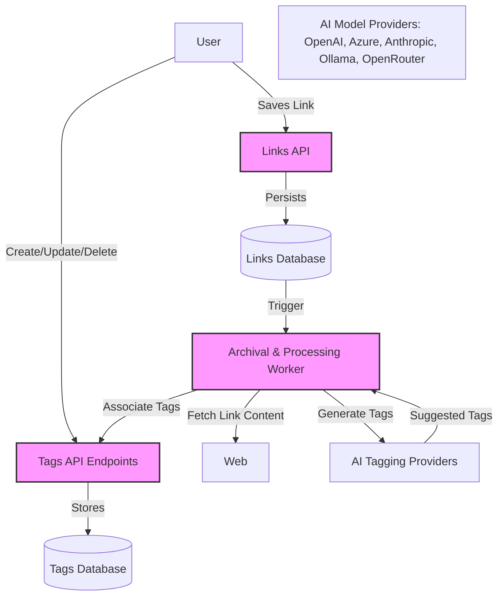

# Tags & AI Tagging API Reference

Manage and organize tags associated with your saved links using Linkwarden's Tags & AI Tagging API endpoints. This set of endpoints not only allows you to create, update, list, and delete tags but also leverages AI-powered automatic tagging to streamline your content curation and discovery process.

---

## Overview
These endpoints empower users to efficiently categorize their links via manual tag management, as well as take advantage of AI-driven tag generation. Whether you want to assign predefined tags, generate brand-new tags based on link content, or reuse your existing tag library, this API makes it seamless to enhance your organizational workflow.

Tags are crucial for content discoverability and organization, providing multifaceted ways to label and retrieve your links across collections.

This documentation focuses on the API endpoints that support:

- Creating new tags
- Updating existing tags
- Deleting tags
- Listing tags for a user
- Utilizing AI-based tagging methods for automatic tag suggestions and assignment

---

## Authentication & Authorization

All operations on tags require authenticated access. Users must include valid authentication credentials (e.g., session tokens or API keys) in their requests as outlined in the [Authentication & Authorization](https://docs.linkwarden.com/api-reference/core-workflows/authentication-and-authorization) documentation.

Users are only permitted to perform tag operations within their own scope; attempting to manage tags that belong to another user will result in authorization errors.

---

## Tag Management Endpoints

### Create Tag

- **Endpoint**: `POST /api/v1/tags`
- **Purpose**: Create a new tag under the authenticated user's ownership.
- **Parameters**:
  - `name` (string, required): The tag name, trimmed to a maximum of 50 characters.
  - Optional tag attributes such as archival behaviors (e.g., `archiveAsScreenshot`) if supported.
- **Example Request**:
```json
{
  "name": "Research",
  "archiveAsScreenshot": true
}
```

- **Outcome**: Returns the newly created tag object with its unique identifier.

---

### Update Tag

- **Endpoint**: `PUT /api/v1/tags/{tagId}`
- **Purpose**: Modify the details of an existing tag owned by the user.
- **Parameters**:
  - `tagId` (path parameter, number): The unique identifier of the tag to update.
  - Request body containing updatable fields like `name` or archival flags.
- **Example**:
```json
{
  "name": "Updated Research",
  "archiveAsPDF": true
}
```

- **Outcome**: Returns the updated tag data.

---

### Delete Tag

- **Endpoint**: `DELETE /api/v1/tags/{tagId}`
- **Purpose**: Remove a tag owned by the user. This action dissociates the tag from any links previously tagged.
- **Parameters**:
  - `tagId` (path parameter, number): The identifier of the tag to delete.
- **Outcome**: Confirmation of deletion or error if tag not found or unauthorized.

---

### List Tags

- **Endpoint**: `GET /api/v1/tags`
- **Purpose**: Retrieve all tags owned by the authenticated user, optionally sorted or filtered.
- **Usage Scenario**: Enables client applications to display user-owned tags for filtering links or tag management UI.

---

## AI-Powered Tagging

AI Tagging elevates your link organization by automatically suggesting and adding relevant tags based on link content, metadata, or your personalized tagging preferences. This feature reduces manual effort and improves the richness of your tag-based search and filtering.

### AI Tagging Methods Supported

Your AI tagging preferences determine how tags are generated or selected:

1. **Generate**: AI independently generates new tags based on the link's description or content.
2. **Existing**: AI chooses from your existing user tags to find relevant matches.
3. **Predefined**: AI selects from a predefined list of tags you've configured.
4. **Disabled**: No automatic tagging is performed.

These settings influence the behavior of the AI tagging endpoint.

### Automatic Tagging Workflow

When a link is archived or saved, the AI tagging system can be triggered programmatically (or internally by Linkwarden workers) to:

- Analyze the link content or meta description.
- Generate or select tags according to your preferred method.
- Limit assigned tags to a maximum of 5 for optimal relevance.
- Attach the tags to the link, creating new tags if necessary.

### AI Tagging Endpoint Usage

Currently, AI tagging is encapsulated in internal workflows triggered by the system during archival or processing of links. Users can configure their AI tagging preferences in the user settings. 

Developers integrating with the API can expect links to be auto-tagged after archival if the user’s AI tagging method is not disabled and if AI provider credentials are configured.

---

## Practical Examples

### Creating a New Tag

```bash
curl -X POST "https://your-instance.com/api/v1/tags" \
  -H "Authorization: Bearer YOUR_TOKEN" \
  -H "Content-Type: application/json" \
  -d '{"name": "Important", "archiveAsPDF": true}'
```

### Updating a Tag

```bash
curl -X PUT "https://your-instance.com/api/v1/tags/123" \
  -H "Authorization: Bearer YOUR_TOKEN" \
  -H "Content-Type: application/json" \
  -d '{"name": "Urgent"}'
```

### Deleting a Tag

```bash
curl -X DELETE "https://your-instance.com/api/v1/tags/123" \
  -H "Authorization: Bearer YOUR_TOKEN"
```

### Listing User Tags

```bash
curl -X GET "https://your-instance.com/api/v1/tags" \
  -H "Authorization: Bearer YOUR_TOKEN"
```

---

## Best Practices & Tips

- **Keep Tags Concise and Meaningful**: Limit tag names to 50 characters for consistency.
- **Leverage AI Tagging for Speed**: Configure AI tagging preferences to automate tag assignment, reducing manual overhead.
- **Manage Predefined Tags for Control**: If your team uses predefined tags, maintain this list actively to guide AI output.
- **Limit Tags per Link**: Although you can assign multiple tags, AI auto-tagging caps at 5 for relevance and performance.
- **Review and Refine**: Periodically audit auto-generated tags to ensure quality and accuracy.

---

## Common Pitfalls & Troubleshooting

<Warning>
Incorrect or missing authentication tokens will prevent tag operations—ensure your credentials are valid and included.
</Warning>

<Warning>
Attempting to delete or update tags not owned by the user will result in authorization errors.
</Warning>

<Note>
If AI tagging yields no tags, verify the link description is present and AI provider credentials (OpenAI, Azure, Anthropic, Ollama, OpenRouter) are correctly configured.
</Note>

<Note>
Tag names longer than 50 characters are truncated automatically—avoid exceeding this limit.
</Note>

---

## Integration Insights

Linkwarden’s AI tagging capabilities utilize multiple AI providers transparently, falling back between OpenAI, Azure, Anthropic, Ollama, and OpenRouter based on configured credentials. This ensures flexibility and resilience in tag generation.

The archival system integrates tagging seamlessly:

1. Upon successfully preserving a link’s content,
2. The AI tagger analyzes the link’s description or text content,
3. Generates or selects tags according to your preferences,
4. Updates the link record and tag relations in the system.

Developers interacting with the API can expect tags to be automatically handled post-archival if enabled.

---

## Further Reading & Related Documentation

- [Authentication & Authorization](https://docs.linkwarden.com/api-reference/core-workflows/authentication-and-authorization) - Secure API usage.
- [Managing Links API](https://docs.linkwarden.com/api-reference/core-workflows/managing-links) - Manage links that tags describe.
- [Collections API](https://docs.linkwarden.com/api-reference/core-workflows/collections-api) - Organize links alongside tags.
- [Smart Tagging & Full-Text Search Guide](https://docs.linkwarden.com/guides/advanced-tasks-and-best-practices/ai-tagging-search) - User guidance on advanced tagging and search.
- [Preservation & Archiving](https://docs.linkwarden.com/api-reference/advanced-features/archives-and-preservation) - Understand preservation’s relationship with tags.

---

## Diagram: Tags & AI Tagging Workflow



This flow illustrates how tags are managed via the API and enriched automatically during link preservation.
