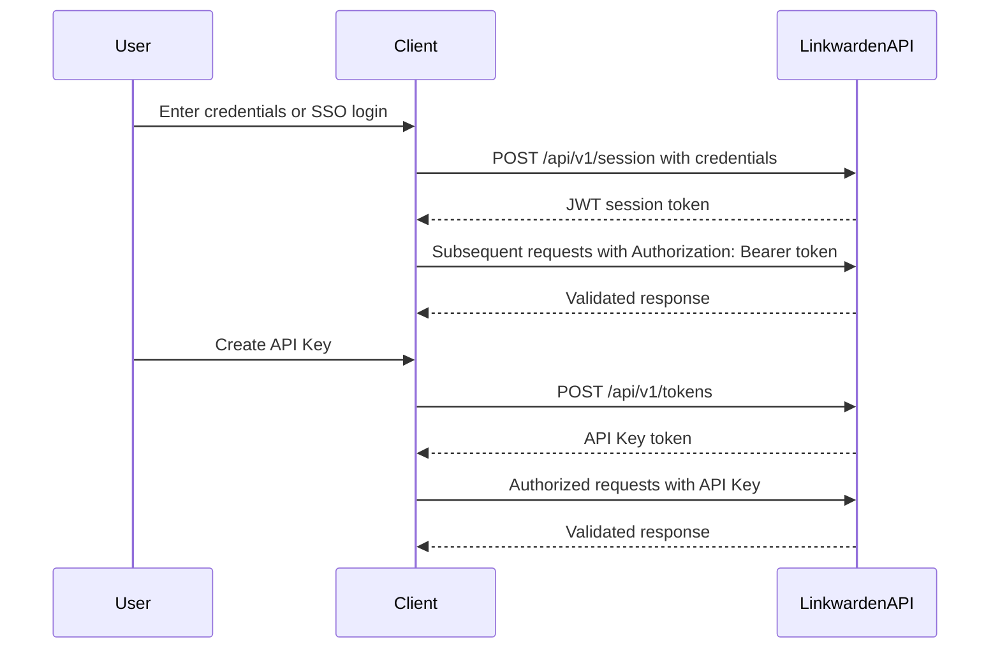

# Authentication & Authorization

Secure access to Linkwarden’s API is foundational for protecting your data and enabling personalized, permission-controlled interactions. This guide walks you through how to authenticate using API keys or session tokens, manage credentials safely, understand permission models, and best practices for securing your integrations.

---

## 1. Authentication Overview

Linkwarden provides two primary authentication mechanisms for API access:

- **Session Tokens (JWT-based)**: Generated upon user login, these tokens represent an authenticated session with standard expiry.
- **API Keys (Access Tokens)**: Persistent tokens you can create to authorize automated or programmatic access.

Both methods authenticate requests and gate access according to user permissions and subscription status.

### Why Authentication Matters

Authenticating your API requests establishes your identity securely, preventing unauthorized access while enabling you to perform actions tied to your user or team account. Whether signing in interactively or using integrations, authentication ensures your data and Linkwarden resources remain protected.

---

## 2. Authentication Methods

### 2.1 Session Tokens (JWT)

When a user signs in interactively via supported providers (credentials, email, various OAuth SSO providers), Linkwarden issues a JWT (JSON Web Token) representing that session.

- These tokens encode your user ID and an expiration timestamp.
- Valid session tokens must accompany API requests in the `Authorization` header as `Bearer <token>`.
- Token revocation occurs if the session is manually revoked or expired.

#### Obtaining a Session Token

Use the `/api/v1/session` endpoint by POSTing valid credentials:

```http
POST /api/v1/session
Content-Type: application/json

{
  "username": "your-username-or-email",
  "password": "your-password",
  "sessionName": "Optional device identifier"
}
```

A successful response includes your JWT token:

```json
{
  "response": {
    "token": "<jwt-token-string>"
  }
}
```

#### Using Session Tokens

Include the token in your request headers:

```http
Authorization: Bearer <jwt-token-string>
```

#### Session Token Expiry

Tokens expire after 30 days by default but can be revoked sooner.

---

### 2.2 API Keys (Access Tokens)

API Keys provide long-lived, revocable credentials for programmatic access. They are ideal for automation, integrations, and scripts.

- Created via the `/api/v1/tokens` endpoint.
- Each key includes a name, user association, and permission scopes.
- Revoking an API key disables it immediately.

#### Creating an API Key

POST to `/api/v1/tokens` with your desired name:

```http
POST /api/v1/tokens
Content-Type: application/json
Authorization: Bearer <jwt-token>

{
  "name": "My Automation Key"
}
```

Successful response returns the token string:

```json
{
  "response": {
    "token": "<api-key-token-string>",
    "id": 123
  }
}
```

#### Listing API Keys

GET `/api/v1/tokens` returns all your active tokens.

```http
GET /api/v1/tokens
Authorization: Bearer <jwt-token>
```

#### Revoking an API Key

DELETE `/api/v1/tokens/{id}` revokes the specified token:

```http
DELETE /api/v1/tokens/123
Authorization: Bearer <jwt-token>
```

---

## 3. Permission Model & Authorization

All authenticated requests are subject to Linkwarden's authorization checks:

- **User Identity**: Your session or token must match a valid user.
- **Subscription Status**: For paid features or API access, an active subscription is required.
- **Token Validity**: Tokens must be active and not revoked.
- **Role & Scopes**: Your API keys or sessions may have scoped permissions restricting operations.

Unauthorized or expired tokens receive `401 Unauthorized` responses with clear error messages.

### Handling Authentication Failures

Common issues include:

- Expired tokens
- Revoked or disabled tokens
- Insufficient subscription privileges
- Email not verified for credential-based logins

API responses will indicate these conditions clearly, allowing you to remedy the issue promptly.

---

## 4. Practical Security Recommendations

Safeguarding your credentials is critical. Follow these best practices:

- **Never expose tokens** in browser consoles, public repos, or logs.
- **Use environment variables** to store credentials in your apps.
- **Regularly review and revoke** unused API keys.
- **Enforce strong passwords and email verification** for credential logins.
- **Limit token scopes and lifespan** where possible.
- **Rotate API keys periodically** to reduce risk of compromise.
- **Monitor access logs** for suspicious activity.

---

## 5. Common User Flows

### 5.1 Interactive User Login Flow

1. User authenticates via username/password or OAuth providers.
2. On success, server issues a JWT session token.
3. Client stores the token securely.
4. Client includes token in all API requests.
5. Server validates token and user subscription.
6. User accesses Linkwarden features as permitted.

### 5.2 Programmatic Access via API Keys

1. User creates an API key via Linkwarden UI or API.
2. Application stores key securely.
3. Application includes API key in `Authorization` header.
4. Linkwarden validates key and scopes.
5. API requests execute with permissions granted.
6. User monitors and revokes API keys as needed.

---

## 6. API Endpoint Reference for Authentication

| Endpoint               | Method | Description                             | Authentication Required? |
|------------------------|--------|-------------------------------------|--------------------------|
| `/api/v1/session`      | POST   | Create session token via credentials  | No (credentials only)    |
| `/api/v1/tokens`       | GET    | List active API keys for user         | Yes                     |
| `/api/v1/tokens`       | POST   | Create new API key                    | Yes                     |
| `/api/v1/tokens/{id}`  | DELETE | Revoke API key by ID                   | Yes                     |

---

## 7. Code Examples

### 7.1 Obtain Session Token

```bash
curl -X POST https://your-linkwarden-domain/api/v1/session \
-H 'Content-Type: application/json' \
-d '{"username":"user@example.com", "password":"yourpassword"}'
```

### 7.2 Use Session Token in API Request

```bash
curl https://your-linkwarden-domain/api/v1/tokens \
-H 'Authorization: Bearer <your-session-token>'
```

### 7.3 Create API Key

```bash
curl -X POST https://your-linkwarden-domain/api/v1/tokens \
-H 'Authorization: Bearer <your-session-token>' \
-H 'Content-Type: application/json' \
-d '{"name": "My API Key"}'
```

### 7.4 Revoke API Key

```bash
curl -X DELETE https://your-linkwarden-domain/api/v1/tokens/123 \
-H 'Authorization: Bearer <your-session-token>'
```

---

## 8. Troubleshooting Common Issues

<AccordionGroup title="Authentication Troubleshooting">
<Accordion title="Invalid Credentials or Email Not Verified">
- Ensure you are using the correct username or email.
- Reset your password if needed.
- Verify your email if the system requires verification before login.
</Accordion>
<Accordion title="Expired or Revoked Tokens">
- Tokens expire after 30 days or can be manually revoked.
- Obtain new session tokens by logging in again.
- Recreate API keys if revoked.
</Accordion>
<Accordion title="Permission Denied Responses">
- Verify your user has an active subscription.
- Check if the API key has sufficient scopes.
- Contact your organization administrator if you suspect access restrictions.
</Accordion>
<Accordion title="Too Many Verification Requests">
- Email verification has rate limits to prevent abuse (max 4 requests per 5 minutes).
- Wait a few minutes before retrying.
</Accordion>
</AccordionGroup>

---

## 9. Diagram: Authentication Flow



---

## 10. Best Practices Summary

- Use session tokens for user-driven interactions.
- Use API keys for background jobs and integrations.
- Always encrypt and secure token storage.
- Regularly audit and revoke unused credentials.
- Handle authentication errors gracefully to guide re-authentication.
- Combine authentication understanding with subscription status checks.

---

For complete user management and subscription validation details, see the [User & Session Management API Reference](/api-reference/core-workflows/user-management).

For integrating with OAuth or SSO providers, consult the [Single Sign-On (SSO) and OAuth Providers Guide](/security/auth-models-identity/sso-third-party).

---

This document ensures you securely and effectively authenticate your requests to Linkwarden, unlocking the full potential of the API.


---

<Note>
For development and testing, the demo mode disables token creation and revocation endpoints to preserve a safe environment.
</Note>

<Info>
Linkwarden integrates multiple OAuth providers, enabling secure SSO flows while maintaining consistent session token management under the hood.
</Info>
