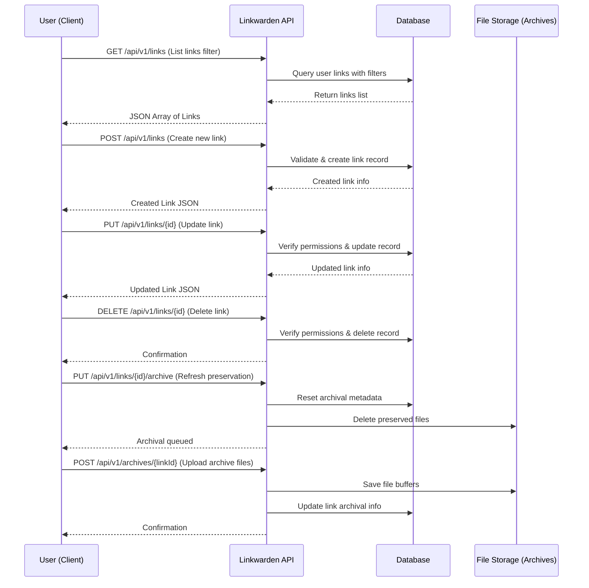

# Managing Links API Reference

Comprehensive documentation for the API endpoints used to create, read, update, delete, and annotate links in Linkwarden. This guide covers individual and bulk operations, request and response examples, and best practices to efficiently associate links with collections, tags, and highlights.

---

## 1. Overview

The Links API provides full control over managing user bookmarks, including:

- Adding new links to collections
- Retrieving links with filtering and sorting
- Updating link properties and metadata
- Deleting single or multiple links
- Managing archival preservation states and annotations

All endpoints require authenticated user context and appropriate permissions on the collections.

---

## 2. Authentication & Authorization

The API enforces user authentication via session tokens or API keys as described in the [Authentication & Authorization](https://linkwarden.app/api-reference/core-workflows/authentication-and-authorization) documentation. 

### Permission Model

- Users must own or have delegated permissions in collections to create, update, or delete links.
- Viewing a link requires read access to the collection.
- Archival actions depend on ownership or explicit "canUpdate" rights.

Unauthorized actions return `401 Unauthorized` errors.

---

## 3. Endpoints

### 3.1. List & Create Links

`GET /api/v1/links`

Retrieve a list of links for the authenticated user with optional filtering.

**Query Parameters:**

| Parameter         | Type    | Description                                             |
|-------------------|---------|---------------------------------------------------------|
| sort              | number  | Sort order (e.g., by date newest/oldest)                |
| cursor            | number  | Pagination cursor for next page                          |
| collectionId      | number  | Filter links by collection ID                            |
| tagId             | number  | Filter links by tag ID                                   |
| pinnedOnly        | boolean | If true, return only pinned links                        |
| searchQueryString | string  | Full-text search query                                  |

**Success Response Example:**
```json
{
  "response": [
    {
      "id": 123,
      "url": "http://example.com",
      "title": "Example Site",
      "collectionId": 10,
      "tags": ["research", "tutorial"],
      "pinned": false
    },
    ...
  ]
}
```


`POST /api/v1/links`

Create a new link in a specified collection.

**Request Body:**

| Field         | Type    | Required | Description                              |
|---------------|---------|----------|------------------------------------------|
| url           | string  | Yes      | The URL to save                          |
| title         | string  | No       | Link title (auto-generated if missing) |
| description   | string  | No       | Notes or additional description         |
| collectionId  | number  | Yes      | Target collection for this link         |
| tags          | array   | No       | Tags associated with the link            |
| pinned        | boolean | No       | Whether link is pinned                    |

**Response:** Newly created link object.

**Error Responses:**
- `400 Bad Request` if duplicate link detected (if duplicates prevention enabled)
- `401 Unauthorized` if user lacks permissions

---

### 3.2. Retrieve, Update, and Delete a Single Link

`GET /api/v1/links/{id}`

Retrieve detailed information for a specific link by ID.

**Response:** Link object with metadata, preservation formats, and annotations.


`PUT /api/v1/links/{id}`

Update metadata or properties of an existing link.

**Request Body:** Partial or full link properties such as:
- `title`
- `description`
- `tags`
- `collectionId`
- `pinned`

**Notes:**
- Collection changes require ownership or contributor permissions.
- Tags can be updated including adding or removing.

**Response:** Updated link object.


`DELETE /api/v1/links/{id}`

Delete a specific link.

**Responses:**
- `200 OK` on successful deletion
- `401 Unauthorized` if permissions are insufficient

---

### 3.3. Bulk Operations on Links

`PUT /api/v1/links`

Modify multiple links in one request for operations like moving collections, adding/removing tags, or updating descriptions.

**Request Body:**

| Field             | Type            | Description                                  |
|-------------------|-----------------|----------------------------------------------|
| links             | array of number | List of Link IDs                            |
| removePreviousTags | boolean         | Whether to remove existing tags before adding new ones |
| newData           | object          | New data to apply (e.g., `{ "collectionId": 5, "pinned": true }`)

**Response:**
- Summary of links updated successfully or failure details.


`DELETE /api/v1/links`

Delete multiple links by IDs in a single request.

**Request Body:**

| Field   | Type            | Description           |
|---------|-----------------|-----------------------|
| linkIds | array of number | Link IDs to delete    |

**Response:**
- Count of links deleted.

**Warning:**
- Bulk deletes confirmed by user on UI to prevent accidental loss.

---

### 3.4. Archival & Preservation Actions

#### Refresh Preservation Data

`PUT /api/v1/links/{id}/archive`

Triggers removing existing preservation data to queue the link for re-archival. Ensures fresh screenshots, PDFs, readable versions, etc.

**Request:**
- No body.

**Response:**
- Confirmation message that archival process is initiated.

**Authorization:**
- Requires user ownership or update permissions on the collection.

#### Manage Preservation Files Upload & Retrieval

`GET /api/v1/archives/{linkId}`

Retrieves archived files such as screenshots or PDFs for the given link.

Query Parameters:

- `format`: Preservation format identifier (e.g., PNG, PDF)
- `preview`: Boolean indicating preview image request

Response:
- Binary content with proper content-type headers.


`POST /api/v1/archives/{linkId}`

Upload or update preservation files for a link (e.g., screenshot or PDF).

**Requirements:**

- Authenticated user with create permissions
- Valid file format and size

**Response:**
- Confirmation of archive update

---

## 4. Data Models & Schemas

### Link Object

| Field          | Type       | Description                                      |
|----------------|------------|--------------------------------------------------|
| id             | number     | Unique identifier for the link                    |
| url            | string     | The URL of the link                              |
| title          | string     | Title or name of the link (auto-generated if empty) |
| description    | string     | Optional notes or description                     |
| collectionId   | number     | ID of the collection the link belongs to         |
| tags           | array      | List of associated tags                           |
| pinned         | boolean    | Whether the link is pinned in the UI              |
| image          | string     | Path to screenshot archive (nullable)             |
| pdf            | string     | Path to PDF archive (nullable)                    |
| readable       | string     | Path to readable archive format (nullable)        |
| monolith       | string     | Path to monolith format (nullable)                |
| preview        | string     | Path to preview image or status                    |
| lastPreserved  | string     | Timestamp of last preservation                     |
| indexVersion   | number     | Version index for cache invalidation              |

Validation schemas enforce correct field types and lengths.

---

## 5. Code Examples

### 5.1. Create a New Link

```bash
curl -X POST "https://linkwarden.app/api/v1/links" \
  -H "Authorization: Bearer {token}" \
  -H "Content-Type: application/json" \
  -d '{
    "url": "https://example.com/article",
    "title": "Example Article",
    "collectionId": 12,
    "tags": ["research", "article"]
  }'
```

### 5.2. Update Multiple Links

```bash
curl -X PUT "https://linkwarden.app/api/v1/links" \
  -H "Authorization: Bearer {token}" \
  -H "Content-Type: application/json" \
  -d '{
    "links": [101, 102, 103],
    "removePreviousTags": true,
    "newData": { "collectionId": 15, "pinned": true }
  }'
```

### 5.3. Delete a Link

```bash
curl -X DELETE "https://linkwarden.app/api/v1/links/123" \
  -H "Authorization: Bearer {token}"
```

### 5.4. Fetch Links with Filters

```bash
curl -X GET "https://linkwarden.app/api/v1/links?collectionId=12&sort=1&pinnedOnly=true" \
  -H "Authorization: Bearer {token}"
```

---

## 6. Best Practices & Tips

- **Duplicate Prevention:** Enable and respect duplicate link prevention settings to avoid clutter.
- **Batch Processing:** Use bulk endpoints to efficiently modify or delete multiple links instead of repeating single requests.
- **Permission Checks:** Always verify if the user has adequate rights before invoking create, update, or delete operations.
- **Archival Refresh:** Regularly refresh preservation data for important links to ensure archival snapshots remain up-to-date.
- **Error Handling:** Handle HTTP 401 responses to prompt re-authentication. Review error messages for common issues like invalid URLs or file types.

---

## 7. Troubleshooting

### Common Issues

| Issue                                 | Cause                                             | Solution                                                      |
|--------------------------------------|--------------------------------------------------|---------------------------------------------------------------|
| 401 Unauthorized                     | Missing or invalid auth token; insufficient permissions | Ensure valid token; confirm collection access permissions      |
| 400 Bad Request on create/update     | Duplicate link or invalid input                    | Check data validity; avoid duplicate URLs                      |
| Archival upload fails                | File rejection due to unsupported format or too large | Confirm file format and size limits (e.g., max 10 MB)           |
| Link not found                      | Link ID does not exist or link was deleted        | Verify link ID correctness, existence                          |

For detailed errors, inspect API JSON responses for `response` fields.

---

## 8. Related Documentation

- [Authentication & Authorization](https://linkwarden.app/api-reference/core-workflows/authentication-and-authorization)
- [Collections API](https://linkwarden.app/api-reference/core-workflows/collections-api)
- [Tags & AI Tagging](https://linkwarden.app/api-reference/advanced-features/tags-and-metadata)
- [Archives & Webpage Preservation](https://linkwarden.app/api-reference/advanced-features/archives-and-preservation)
- [Bulk Operations Guide](https://linkwarden.app/guides/advanced-tasks-and-best-practices/bulk-actions)

---

## 9. Summary Diagram: Links Management Workflow



---

This reference provides the foundation needed to confidently integrate and automate Linkwarden's link management via its robust API.

