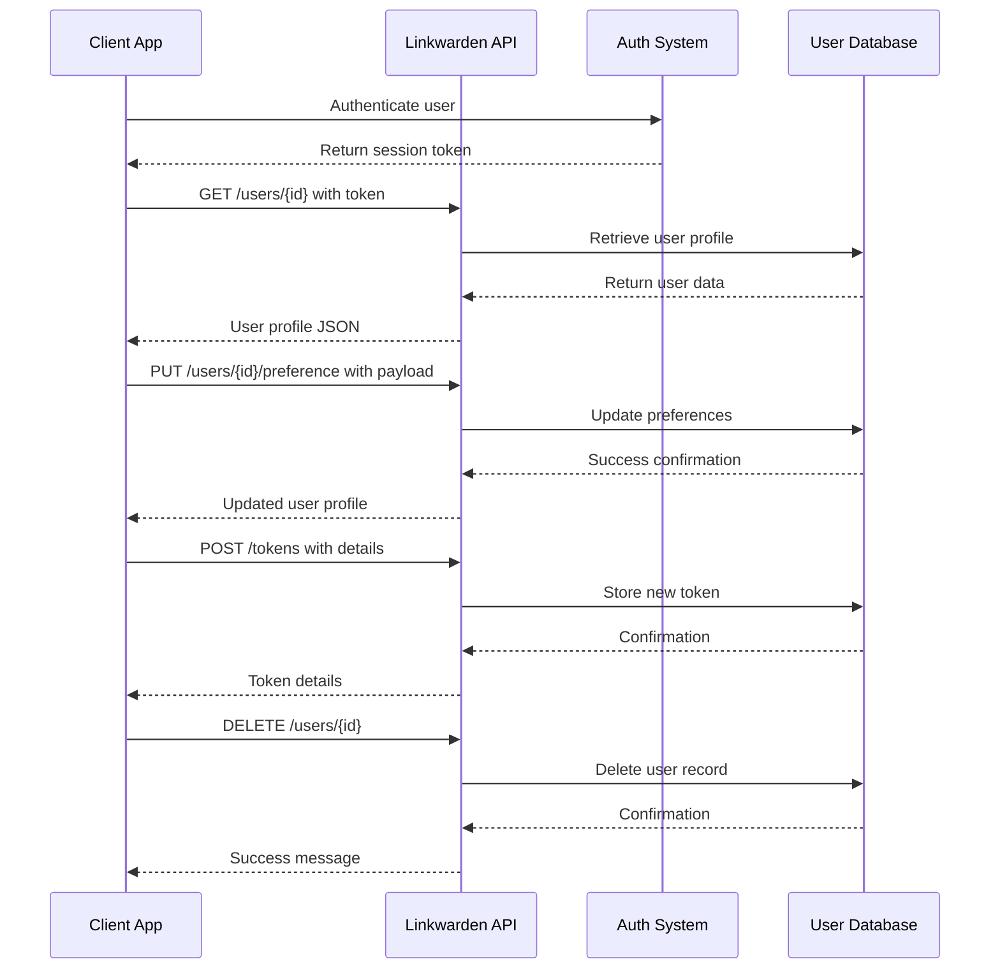

# User & Session Management API Reference

Manage your Linkwarden users and sessions efficiently with our comprehensive API endpoints. This section details all APIs required for user management, user profile retrieval, preference updates, administrative operations, session handling, onboarding tasks, and critical account security functions.

---

## 1. Overview

The User & Session Management APIs empower you to manage users and their sessions programmatically. Whether you are creating new users, fetching user profiles, managing user preferences, handling authentication sessions, or performing administrative tasks like deleting users or managing API tokens, these endpoints provide full control with secure and permission-checked access.

- **Base API Path**: `/api/v1/users`
- **Authentication**: Required (via tokens or session-based authentication)
- **Admin Privileges**: Some operations require server admin roles
- **Rate Limits**: Governed under general API rate-limiting policies

These endpoints work together to streamline onboarding flows, update user preferences, manage sessions securely, and facilitate administrative user operations.

---

## 2. Authentication & Authorization

All user management endpoints require proper authentication. Most common methods include:

- **Session-based Auth**: Managed via NextAuth sessions
- **Bearer Tokens**: API tokens issued via Token Management APIs
- **Admin Verification**: Endpoints that modify or delete users validate if the requester is an admin (defined by `NEXT_PUBLIC_ADMIN` environment variable or user subscription roles)

**Security Best Practices:** Always use HTTPS and secure tokens; never expose credentials. Respect permission boundaries to avoid unauthorized user data access.

---

## 3. Endpoints

### 3.1 List Users

Fetch a list of all users.

- **Method**: GET
- **Endpoint**: `/api/v1/users`
- **Description**: Retrieves an array of users accessible by the authenticated user.
- **Authentication**: Required

#### Request
```http
GET /api/v1/users HTTP/1.1
Authorization: Bearer <token>
```

#### Response
```json
{
  "response": [
    {
      "id": 1,
      "username": "alice",
      "email": "alice@example.com",
      "emailVerified": "2024-05-01T12:00:00Z",
      "theme": "dark",
      // other user properties
    }
  ]
}
```

---

### 3.2 Create a New User

Create a user account.

- **Method**: POST
- **Endpoint**: `/api/v1/users`
- **Description**: Creates a new user. Disabled in demo mode.
- **Authentication**: Not required for public sign-up

#### Request Body
```json
{
  "username": "newuser",
  "email": "newuser@example.com",
  "password": "securePassword123"
}
```

#### Response
```json
{
  "response": {
    "id": 123,
    "username": "newuser",
    "email": "newuser@example.com"
  }
}
```

---

### 3.3 Get User Profile

Retrieve detailed user information by ID.

- **Method**: GET
- **Endpoint**: `/api/v1/users/{id}`
- **Description**: Returns user profile data. Includes subscription and dashboard sections.
- **Authentication**: Required
- **Permissions**: User may retrieve own data; Admin can retrieve any user's data

#### Path Parameter
| Name | Type | Description                    |
|-------|-------|------------------------------|
| id    | number| The ID of the user to retrieve|

#### Request
```http
GET /api/v1/users/42 HTTP/1.1
Authorization: Bearer <token>
```

#### Response
```json
{
  "response": {
    "id": 42,
    "username": "johndoe",
    "email": "johndoe@example.com",
    "theme": "light",
    "subscription": {
      "plan": "premium",
      "active": true
    },
    "dashboardSections": [
      {"order": 0, "type": "STATS"},
      {"order": 1, "type": "RECENT_LINKS"}
    ]
  }
}
```

---

### 3.4 Update User Profile

Update user details or preferences.

- **Method**: PUT
- **Endpoint**: `/api/v1/users/{id}`
- **Description**: Modify user information; limited by permission.
- **Authentication**: Required
- **Permissions**: Users can update own profile; Admins can update any profile

#### Request Body
Can include any updatable fields, e.g.,
```json
{
  "username": "newusername",
  "theme": "dark"
}
```

#### Response
```json
{
  "response": {
    "id": 42,
    "username": "newusername",
    "theme": "dark"
  }
}
```

---

### 3.5 Delete User

Remove a user account from the system.

- **Method**: DELETE
- **Endpoint**: `/api/v1/users/{id}`
- **Description**: Deletes user account. Requires admin rights or self-deletion.
- **Authentication**: Required
- **Permissions**: Admin or the user themselves

#### Request
```http
DELETE /api/v1/users/42 HTTP/1.1
Authorization: Bearer <token>
```

#### Response
```json
{
  "response": "User deleted successfully."
}
```

---

### 3.6 Update User Preferences

Manage user-specific settings like theme or notification preferences.

- **Method**: PUT
- **Endpoint**: `/api/v1/users/{id}/preference`
- **Description**: Update preferences for the authenticated user.
- **Authentication**: Required
- **Permissions**: User can only update own preferences

#### Request Body Example
```json
{
  "theme": "dark",
  "language": "en-US"
}
```

#### Response
```json
{
  "response": {
    "id": 42,
    "theme": "dark",
    "language": "en-US"
  }
}
```

---

### 3.7 Get Public User Profile

Retrieve public-facing user data by ID or username.

- **Method**: GET
- **Endpoint**: `/api/v1/public/users/{id_or_username}`
- **Description**: Returns limited user data publicly available.
- **Authentication**: Not required

#### Request
```http
GET /api/v1/public/users/johndoe HTTP/1.1
```

#### Response
```json
{
  "response": {
    "id": 42,
    "username": "johndoe",
    "publicCollections": 5
  }
}
```

---

### 3.8 Manage API Tokens

Create, list, and delete personal API tokens for authentication.

#### Create Token
- **Method**: POST
- **Endpoint**: `/api/v1/tokens`
- **Description**: Generates a new API token.

#### List Tokens
- **Method**: GET
- **Endpoint**: `/api/v1/tokens`
- **Description**: Lists all tokens for the authenticated user.

#### Delete Token
- **Method**: DELETE
- **Endpoint**: `/api/v1/tokens/{id}`
- **Description**: Deletes a specific API token by ID.

#### Example Create Request
```http
POST /api/v1/tokens HTTP/1.1
Authorization: Bearer <token>
Content-Type: application/json

{
  "name": "My API Token",
  "scopes": ["read", "write"]
}
```

#### Example List Response
```json
{
  "response": [
    {"id": 1, "name": "My API Token", "createdAt": "2024-05-01T12:00:00Z"}
  ]
}
```

---

### 3.9 Data Migration

Migrate user data into or out of Linkwarden.

- **Method**: GET (Export Data), POST (Import Data)
- **Endpoint**: `/api/v1/migration`
- **Description**: Export your data backup as JSON or import data from multiple supported formats (HTML file, Linkwarden native, Wallabag, Pocket, Omnivore). Disabled in demo mode.

#### Export Request
```http
GET /api/v1/migration HTTP/1.1
Authorization: Bearer <token>
```

#### Import Request Body
```json
{
  "format": "htmlFile",
  "data": "<html>...</html>"
}
```

---

## 4. User Flow Example: Updating User Preferences

1. **Fetch user ID** using authentication session.
2. **Send PUT request** to `/api/v1/users/{id}/preference` with new preference data.
3. **Receive updated user profile** confirming changes.
4. **Apply new theme** or preferences in your frontend UI immediately.

### Example with curl
```bash
curl -X PUT \
  -H "Authorization: Bearer <token>" \
  -H "Content-Type: application/json" \
  -d '{"theme": "dark"}' \
  https://your-linkwarden-domain.com/api/v1/users/42/preference
```

---

## 5. Best Practices

- Always verify user roles before invoking admin-level operations.
- Use API tokens scoped with least privilege to minimize risks.
- Handle error status codes (401 Unauthorized, 403 Forbidden, 404 Not Found, 429 Too Many Requests) gracefully.
- Respect rate limits to avoid request throttling.
- Use the public user endpoints to fetch non-sensitive user info without authentication.

---

## 6. Troubleshooting & Common Issues

### Problem: Unauthorized Access
- Confirm your token/session is valid and has the necessary permissions.
- Verify your user has admin privileges for restricted operations.

### Problem: Action Disabled in Demo Mode
- Demo environments disable mutation operations; use a live environment.

### Problem: Invalid User IDs
- Ensure user IDs are numeric where required.
- Use public endpoints with usernames or IDs as supported.

### Problem: Preference Updates Not Reflected Immediately
- Frontend should apply new settings like theme dynamically after update.

---

## 7. Related Documentation Links

- [Authentication & Authorization](/api-reference/core-workflows/authentication-and-authorization) for login and token management
- [Managing Links](/api-reference/core-workflows/managing-links) for bookmark CRUD operations
- [Inviting Collaborators](/guides/collaboration-and-sharing/inviting-collaborators) for team management
- [API Tokens & Access Control](/api-reference/advanced-features/api-tokens) to manage secure API credentials

---

## 8. Diagram: User & Session Management Workflow



---

## 9. Code Example: Fetch User Profile (JavaScript)

```javascript
async function fetchUserProfile(userId, token) {
  const response = await fetch(`/api/v1/users/${userId}`, {
    headers: { Authorization: `Bearer ${token}` },
  });

  if (!response.ok) throw new Error('Failed to fetch user profile');

  const data = await response.json();
  return data.response;
}

// Usage
fetchUserProfile(42, 'your_api_token_here')
  .then(user => console.log(user))
  .catch(console.error);
```

---

## 10. Code Example: Update User Preference (Python)

```python
import requests

api_url = 'https://your-linkwarden-domain.com/api/v1/users/42/preference'
headers = {
    'Authorization': 'Bearer your_api_token',
    'Content-Type': 'application/json'
}
data = {"theme": "dark", "language": "en-US"}

response = requests.put(api_url, json=data, headers=headers)

if response.ok:
    print('Preference updated:', response.json()['response'])
else:
    print('Error:', response.status_code, response.text)
```


---

This completes the comprehensive User & Session Management API reference, designed to enable developers to efficiently administer user data, sessions, and related administrative functions within Linkwarden.