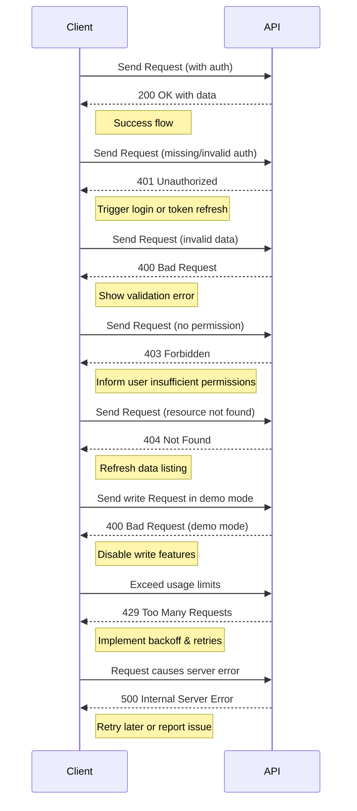

# Error Handling & Status Codes

Efficiently managing errors is critical when integrating with the Linkwarden API. This documentation provides a comprehensive guide to the error codes, typical failure scenarios, response formats, and practical strategies for handling errors gracefully. By understanding how the API communicates issues, you can design resilient applications that guide users toward successful outcomes even when faults occur.

---

## 1. Error Response Structure

Every error returned by the Linkwarden API follows a consistent JSON format that provides clarity on the failure reason, enabling your application to programmatically react or display meaningful messages to end users.

```json
{
  "response": "Detailed error message describing the problem."
}
```

This simple structure encapsulates the error reason in the `response` field. Your integration should always check for non-2xx HTTP status codes and parse this field to understand the cause of failure.

---

## 2. Common HTTP Status Codes and Their Meanings

| Status Code | Meaning                           | Typical Cause and Handling                                             |
|-------------|---------------------------------|----------------------------------------------------------------------|
| 200 OK      | Success                         | Request fulfilled successfully. Proceed with normal flow.             |
| 400 Bad Request | Client-side validation failure | Malformed input, invalid parameters, or schema validation errors.
|             |                                 | Validate client input and retry with corrected data.                   |
| 401 Unauthorized | Missing or invalid authentication | User not logged in or lacks valid credentials.
|             |                                 | Prompt for login or refresh token.                                     |
| 403 Forbidden | Access denied                  | User lacks permissions for the requested resource.
|             |                                 | Review user's access scope; inform user properly.                      |
| 404 Not Found | Resource missing               | The requested entity does not exist (e.g., a link or user).
|             |                                 | Verify identifiers before requests.                                    |
| 405 Method Not Allowed | HTTP verb unsupported    | Endpoint doesn't support the HTTP method used.
|             |                                 | Review API documentation for allowed methods.                          |
| 409 Conflict | Conflict in state              | Attempted duplicate resource creation or conflicting update.
|             |                                 | Adjust data and retry, ensuring uniqueness and correctness.            |
| 429 Too Many Requests | Rate limit exceeded       | Too many requests within rate limits.
|             |                                 | Respect retry-after headers; implement exponential backoff.           |
| 500 Internal Server Error | Server fault           | Unexpected server condition.
|             |                                 | Retry after delay or notify support if persistent.                     |

---

## 3. Typical Failure Scenarios and How to Handle Them

### 3.1 Authentication Failures

**Scenario:** You receive a `401 Unauthorized` response when calling any protected endpoint.

**Cause:** The API session is missing, expired, or invalid. If using API tokens, the token might be revoked or malformed.

**Best Practice:**
- Always include authentication credentials (session cookie or API token) in the request.
- Implement logic to detect `401` responses and trigger login flows or token refresh.
- Avoid exposing sensitive credentials in logs.

### 3.2 Permission Denied

**Scenario:** API responds with `403 Forbidden` when performing an action such as updating or deleting a link.

**Cause:** The authenticated user does not have the necessary rights on the resource (e.g., not owner or insufficient collection permissions).

**Best Practice:**
- Verify user roles and permissions before request submission.
- Provide clear feedback to users about insufficient permissions.
- Re-fetch or refresh permissions if necessary.

### 3.3 Validation Errors

**Scenario:** `400 Bad Request` with error message citing validation issues.

**Cause:** Data sent fails schema validation (e.g., missing required fields, invalid format, or exceeding limits).

**Best Practice:**
- Use the published JSON schemas (e.g., Zod schemas used internally) to validate all inputs client-side before sending.
- Provide user-friendly error messages based on the returned validation details.
- For bulk operations, handle partial failures gracefully.

### 3.4 Resource Not Found

**Scenario:** Trying to retrieve or modify a resource by ID, but getting `404 Not Found`.

**Cause:** The requested link, user, or collection does not exist or is inaccessible.

**Best Practice:**
- Confirm resource existence and user access prior to intensive operations.
- For dynamic UIs, refresh listings following operations that might remove resources.

### 3.5 Demo Mode Restrictions

**Scenario:** API returns `400 Bad Request` with message indicating action is disabled.

**Cause:** The backend is running in read-only demo mode (`NEXT_PUBLIC_DEMO=true`) which disables any write operations.

**Best Practice:**
- Check environment or API messages before attempting modifications in demos.
- Display appropriate warnings to users in demo environments.

### 3.6 Rate Limiting and Quotas

**Scenario:** Excessive API call volume leads to `429 Too Many Requests`.

**Cause:** The client has exceeded usage limits set by the API.

**Best Practice:**
- Implement client-side rate limiting.
- Respect any `Retry-After` headers sent in responses.
- Cache responses where possible.

---

## 4. Handling Bulk Operation Errors

Endpoints that accept bulk updates or deletions (such as `PUT /api/v1/links` or `DELETE /api/v1/links`) can have partial successes and failures:

- The API returns an overall status and response message.
- If part of the batch fails (e.g., due to permissions or data errors), the response will indicate which links failed.

**Best Practices:**
- Implement retry logic per item where possible.
- Inform users which items succeeded or failed with specific reasons.
- Use pagination and chunking to keep batch sizes manageable.

---

## 5. Sample Error Response Examples

### 5.1 Unauthorized Access

```http
HTTP/1.1 401 Unauthorized
Content-Type: application/json

{
  "response": "Permission denied."
}
```

### 5.2 Validation Error on Link Creation

```http
HTTP/1.1 400 Bad Request
Content-Type: application/json

{
  "response": "Error: Missing required field 'url' [url]"
}
```

### 5.3 Demo Mode Write Attempt

```http
HTTP/1.1 400 Bad Request
Content-Type: application/json

{
  "response": "This action is disabled because this is a read-only demo of Linkwarden."
}
```

---

## 6. Practical Tips for Robust Error Handling

- **Always check HTTP status codes** and handle errors before processing response data.
- **Parse error messages** from the `response` field for actionable UI feedback.
- **Log error details** for troubleshooting while avoiding leaking sensitive data.
- **Handle network errors** and timeouts with retries and user notifications.
- **Use API documentation** to verify correct usage of endpoints and required parameters.
- **Incorporate permission checks** and validation locally to reduce round-trips.
- **Respect demo/restricted mode limitations** by disabling write operations in UI.

---

## 7. Summary Diagram of Error Propagation Flow



---

## 8. Additional Resources

- [Authentication & Authorization](https://docs.linkwarden.app/api-reference/core-workflows/authentication-and-authorization) – Learn how to properly authorize requests and manage credentials.
- [Managing Links API](https://docs.linkwarden.app/api-reference/core-workflows/managing-links) – Details on create, update, delete endpoints with validation.
- [User & Session Management](https://docs.linkwarden.app/api-reference/core-workflows/user-management) – User-related endpoints and permissions overview.
- [Rate Limits & Usage Quotas](https://docs.linkwarden.app/api-reference/integration-and-support/rate-limits-and-quotas) – Understand API consumption constraints.
- [SDK Usage & Code Snippets](https://docs.linkwarden.app/api-reference/integration-and-support/sdk-examples) – Integration examples that demonstrate proper error handling.

<Tip>
Testing your API integrations under failure conditions (invalid tokens, missing permissions, malformed requests) will significantly improve your app’s resilience and user experience.
</Tip>

---

By following the error handling guidelines and best practices outlined on this page, you will ensure your application interacts with the Linkwarden API in a robust, user-friendly, and secure manner.

---

# End of Documentation
