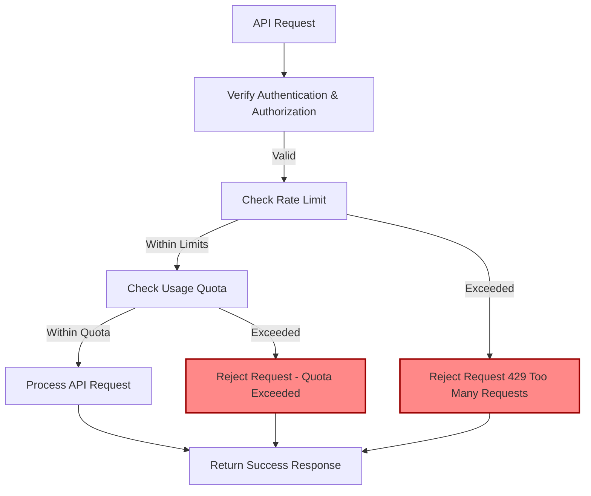

# Rate Limits & Usage Quotas

Understand how Linkwarden protects its API and resources through rate limiting and usage quotas. This documentation explains the API’s rate limiting strategies, quota policies, throttle mechanics, how to monitor usage, and how to handle limits gracefully to ensure reliable and uninterrupted integrations.

---

## Introduction

When integrating deeply with the Linkwarden API, it’s vital to be aware of the system’s rate limiting and usage quota mechanisms. These controls prevent abuse, ensure fair resource distribution among users, and maintain platform stability under high demand.

This page guides you through Linkwarden’s approach to rate limits and quotas, helping you build robust applications that respect these boundaries.

---

## What Are Rate Limits and Usage Quotas?

- **Rate Limits:** Restrictions on how many API requests a client can make within a certain time window (e.g., requests per minute). These prevent spikes or abusive traffic that can degrade service.
- **Usage Quotas:** Longer-term caps on resource usage, such as the total number of links a user can create or import, ensuring balanced system consumption over time.

Together, these guardrails protect Linkwarden’s infrastructure and ensure consistent performance for all users.

---

## How Rate Limiting Works

While Linkwarden’s internal rate limit values are not explicitly exposed via API endpoints, the service enforces throttle controls on your API requests. When you exceed these limits, the API will return an HTTP `429 Too Many Requests` response.

### Recognizing Rate Limit Responses

When your application receives a `429` status, it indicates you should slow down your request rate. The response will include a message describing the limit breach.

### Best Practices to Manage Rate Limits

- **Implement retries with exponential backoff.** Gradually delay retries instead of hammering the server.
- **Batch requests where possible.** Combine multiple operations into fewer calls.
- **Cache responses when applicable.** Reduce redundant API calls.
- **Monitor returned headers and error payloads.** Use these signals to adjust frequency dynamically.

---

## Usage Quotas for Links and Imports

Linkwarden enforces usage quotas primarily related to link creation and import counts. This prevents individual users or organizations from exceeding their allocated capacity.

### Maximum Links Per User

- By default, each user can create or import up to `30,000` links.
- This limit is configurable via the environment variable `MAX_LINKS_PER_USER` on your instance.

### Organizational/SaaS Subscription Limits

- When integrated with Stripe billing, organizations with subscriptions get multiplied quotas based on the number of seats purchased.
- Total allowable links = `MAX_LINKS_PER_USER` × subscription quantity (number of seats).

---

## How Quotas Are Checked

Linkwarden proactively checks a user’s current count of links before allowing imports or additions.

This happens through an internal verification process [see `hasPassedLimit` logic]:

- Counts existing links created by the user.
- For subscription seats, sums links across all team members under the same subscription.
- Compares the sum plus requested new imports against the maximum allowed.

If the import pushes a user beyond their quota, the operation is rejected with a clear error message.

---

## Practical Example: Handling Quotas When Importing Links

Suppose you are building an import feature in your integration:

```javascript
async function importLinks(userId, linksToImport) {
  const overLimit = await hasPassedLimit(userId, linksToImport.length);
  if (overLimit) {
    throw new Error(
      'Import exceeds your link quota. Please reduce the batch size or upgrade your subscription.'
    );
  }
  // Proceed with import
}
```

This ensures your app respects Linkwarden’s usage policies and improves user experience by pre-validating batch sizes.

---

## Monitoring Your API Usage

Though Linkwarden does not currently provide an endpoint to query your exact rate limit status dynamically, you should design your client applications to:

- Track the number of requests made within typical rate-limit windows.
- Log and alert on receiving `429` responses.
- Use application-level logging or dashboards on your backend to identify unusual API usage bursts.

Future versions may expose more detailed usage dashboards.

---

## Handling Rate Limits and Quotas Gracefully

<Tip>
When you encounter rate limits or quota exceedances:

- Immediately back off request frequency.
- Notify users or consuming services with actionable messages.
- Suggest waiting or upgrading their subscription for capacity increases.
- For large imports, split them into smaller chunks safely within allowed limits.
</Tip>

---

## Troubleshooting Common Rate Limit Issues

<AccordionGroup title="Common Issues and Solutions">
<Accordion title="Received HTTP 429 Too Many Requests">
- Reduce request frequency.
- Implement exponential backoff retry strategies.
- Check if loops or automated processes are over-generating calls.
</Accordion>
<Accordion title="Import Fails Due to Quota Exceeded">
- Check current link counts.
- Segment imports into smaller batches.
- Evaluate current subscription and consider expansion.
</Accordion>
<Accordion title="Unexplained API Rejections or Throttling">
- Verify authentication and authorization which can sometimes trigger rejection.
- Monitor logs for spikes from specific IPs or tokens.
- Contact Linkwarden support for assistance if issues persist.
</Accordion>
</AccordionGroup>

---

## Summary

By understanding and respecting Linkwarden’s rate limits and usage quotas, you ensure your integrations remain reliable and performant. Anticipate limits through client-side monitoring and adopt best practices like batching, retries, and user notifications. For sustained high-volume usage, review subscription options to increase quotas accordingly.

---

## See Also

- [Authentication & Authorization](/api-reference/core-workflows/authentication-and-authorization) — Secure access for your API calls.
- [API Tokens & Access Control](/api-reference/advanced-features/api-tokens) — Manage and rotate your access tokens safely.
- [Managing Links API](/api-reference/core-workflows/managing-links) — Link creation and management workflows.
- [Error Handling & Status Codes](/api-reference/integration-and-support/error-handling) — Interpret and act on API errors effectively.

---

## Diagram: Rate Limiting and Quota Enforcement Flow



This flow illustrates how each incoming API request is processed, balancing authentication, rate limits, and user quotas to maintain fair and secure system usage.

---

## Environment Configuration for Limits

| Name                  | Description                                    | Default | Notes                                  |
|-----------------------|------------------------------------------------|---------|----------------------------------------|
| MAX_LINKS_PER_USER    | Maximum number of links a user can store       | 30000   | Can be adjusted by instance admin      |
| NEXT_PUBLIC_STRIPE    | Enables Stripe-based subscription features     | false   | Determines subscription quota behavior |

Ensure these are configured according to your operational and subscription model needs.

---

For further assistance or custom quota arrangements, please reach out to the Linkwarden support team or consult your subscription administrator.


