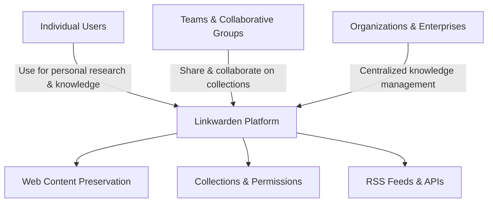

# Who is Linkwarden For?

Linkwarden is designed to serve a broad spectrum of users who need reliable, long-term web content preservation and organized knowledge management. This page outlines the primary audiences and highlights the workflows and use cases where Linkwarden delivers the greatest value.

---

## 1. Individual Users: Personal Research & Knowledge Management

### Use Cases
- Saving and organizing articles, research papers, tutorials, and reference webpages for personal projects or lifelong learning.
- Preserving web content to avoid link rot or changes, enabling consistent future access.
- Curating collections on hobbies, professional topics, or ongoing learning with easy tagging and annotations.

### Why Linkwarden Works for Individuals
- **Automatic Preservation:** Seamlessly capture screenshots, PDFs, and archive.org snapshots of pages, keeping them accessible offline.
- **Flexible Organization:** Create collections and multi-level subcollections to mirror your personal workflows.
- **Rich Search & Tagging:** Quickly locate saved materials by full-text search or AI-enhanced tags.
- **Cross-Platform Access:** Use Linkwarden's web app or mobile apps to save and review links anywhere.

<Check>
If you want a personal digital library that protects against link rot and helps you stay organized, Linkwarden supports your needs end-to-end.
</Check>

---

## 2. Teams and Collaborative Groups

### Use Cases
- Research teams compiling and maintaining curated collections relevant to projects or domains.
- Content managers organizing and sharing resources internally with fine-grained access control.
- Educators and academic groups collecting references, links to teaching materials, and collaborative notes.

### Why Linkwarden Works for Teams
- **Shared Collections with Permissions:** Invite collaborators with defined roles to view, contribute, or administrate collections.
- **Real-Time Collaboration:** Synchronize collections so members have up-to-date access to links and annotations.
- **Secure Sharing:** Control public vs. private visibility at the collection level, ensuring confidentiality where needed.
- **Subscription Seat Management:** Easily add or remove users while tracking subscription seats for organizations.

<Tip>
Invite your team members and manage their roles via the [Inviting Collaborators guide](/guides/collaboration-and-sharing/inviting-collaborators) to maximize collaborative productivity.
</Tip>

---

## 3. Organizations & Enterprises

### Use Cases
- Enterprises seeking centralized knowledge preservation and curated resource collections across departments.
- Legal, compliance, or archival teams requiring persistent access to web-based evidence and documentation.
- Community platforms or content hubs that aggregate and share knowledge publicly or selectively.

### Why Linkwarden Works for Organizations
- **Role-Based Access Controls:** Implement tailored permission models ensuring data security and controlled collaboration.
- **Compliance Support:** Benefit from auditability, data encryption, and configurable privacy/sharing controls aligned with regulatory needs.
- **Integration & Automation:** Leverage RSS feed subscriptions, API tokens, and automation to sync content at scale.
- **Scalable Infrastructure:** Supports deployment in self-hosted or cloud environments with scaling strategies for high load.

<Info>
For organizations, Linkwarden’s security and compliance documentation avenues like [Authorization & Permissions](/security/auth-models-identity/authorization-models) and [Data Encryption](/security/data-privacy-protection/data-encryption) offer detailed assurances.
</Info>

---

## 4. Workflows Linkwarden Supports

- **Personal Knowledge Base:** Collect and refine useful content for future reference and idea incubation.
- **Continuous Research:** Maintain a dynamic, searchable repository of domain-specific materials shared among peers.
- **Web Content Archiving:** Safeguard important web pages against disappearance or content modification.
- **Team Collaboration:** Foster knowledge sharing and controlled access among distributed members.
- **Automated Update Tracking:** Use RSS subscriptions to automatically ingest new content.

<Note>
Whether you are an individual enthusiast, a small team, or a large organization, Linkwarden adapts to your scale and workflow requirements.
</Note>

---

## 5. Getting Started & Next Steps

- Visit the [Quickstart: Adding and Preserving Your First Link guide](/getting-started/initial-experience-validation/quickstart-adding-links) to experience immediate value.
- Explore organizational best practices in [Collections & Tags basics](/guides/getting-started/collections-and-tags-basics).
- For team setups, the [Inviting Collaborators guide](/guides/collaboration-and-sharing/inviting-collaborators) is essential.

---

## Related Documentation

- [Target Audience & Use Cases](/overview/introduction-and-value/target-audience-use-cases) — Deeper insight into real-world scenarios
- [Feature Overview](/overview/core-concepts-and-architecture/feature-overview) — Core capabilities of Linkwarden
- [Privacy & Sharing Controls](/security/data-privacy-protection/privacy-sharing-controls) — Managing visibility and permissions
- [Deployment & Scaling](/deployment/operations-monitoring/scaling-strategies) — Planning for organizational growth

---

_No matter who you are, Linkwarden is built to protect your valuable web content and empower your knowledge workflows with simplicity, security, and scalability._

---

## Frequently Asked Questions

<AccordionGroup title="Common Questions">
<Accordion title="Can individuals and teams use Linkwarden together?">
Yes. Linkwarden supports both personal accounts and shared team collections, allowing seamless collaboration without sacrificing personal organization.
</Accordion>
<Accordion title="Is Linkwarden suitable for enterprise security requirements?">
Absolutely. Linkwarden offers role-based permissions, encryption, audit logs, and environment configuration options designed to meet enterprise standards.
</Accordion>
<Accordion title="Can I transition from personal use to team use easily?">
Yes. You can start with a personal account and later invite collaborators to join collections, enabling a smooth progression to team workflows.
</Accordion>
<Accordion title="How does Linkwarden preserve web content?">
Linkwarden captures multiple archival formats including screenshots, PDFs, reader views, and integrates archive.org snapshots to ensure lasting access.
</Accordion>
</AccordionGroup>

---

## Troubleshooting Tips

- If you encounter issues inviting collaborators, check your subscription seat availability.
- For link preservation failures, verify that archival jobs are not queued excessively or blocked by network policies.
- Ensure team members use supported browsers or mobile apps for consistent experience.

For detailed help, see [Troubleshooting & Common Setup Issues](/getting-started/initial-experience-validation/troubleshooting-common-issues).

---

## Visual Summary

---

_Last updated: June 2024_

---