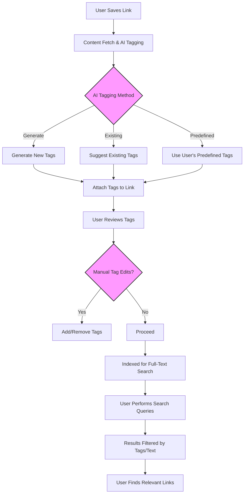

# Smart Tagging and Full-Text Search

Efficiently organizing and finding links at scale is a core strength of Linkwarden. This guide takes you through how automatic AI-based tagging simplifies metadata creation, how to manually refine tags for precision, and how to harness Linkwarden's powerful full-text search capabilities to pinpoint exactly what you need—fast.

---

## 1. Workflow Overview

### Task Description
Learn to use Linkwarden's smart tagging, including automatic AI tagging, manual tag management, and advanced search queries to organize and retrieve links efficiently.

### Prerequisites
- A Linkwarden account with saved links.
- AI tagging enabled in your user settings.
- Some links with tags applied either manually or via automation.
- Basic familiarity with navigating Linkwarden's web or mobile app.

### Expected Outcome
- Links are automatically enriched with relevant tags.
- Users can update and refine tags manually for better accuracy.
- Mastery of search syntax to filter and find links quickly using tags and full-text properties.

### Time Estimate
15–30 minutes to familiarize with tagging and search features.

### Difficulty Level
Intermediate: Requires understanding of tagging concepts and search operators.

---

## 2. Automatic AI-Based Tagging Flow

Linkwarden leverages AI models to analyze the contents or metadata of your links and generate meaningful tags, making your collections smarter and easier to navigate.

### How It Works
- When you add or preserve a link, the system evaluates its content or description.
- Based on your AI tagging preference (Generate, Existing, or Predefined), it produces a set of recommended tags.
- Tags are then automatically associated with the link, up to a maximum of five.

### Enabling AI Tagging
1. Navigate to your user account settings.
2. Ensure AI tagging is enabled and select your preferred AI tagging method:
   - **Generate**: AI creates new tag suggestions.
   - **Existing**: AI suggests from your existing tag vocabulary.
   - **Predefined**: AI uses a preset list you supplied.

### Example Scenario
- You save a link about renewable energy advancements.
- The AI generates tags like "Renewable Energy", "Sustainability", "Climate Change".
- These tags help you later filter your content by these important themes.

<Tip>
Make sure API keys for AI models are correctly set up in your Linkwarden environment for AI tagging to function.
</Tip>

---

## 3. Manual Tagging Refinements

Even with AI assistance, your insight is vital to keep tags relevant and precise.

### Adding or Removing Tags
1. Open the link detail view.
2. Click the tags section to add tags by typing and selecting existing tags or create new ones.
3. Remove any irrelevant tags by clicking the remove icon next to them.

### Bulk Tag Editing
- Use the bulk edit feature to add or remove tags across multiple links simultaneously.
- Decide whether to append new tags or replace existing tags entirely for consistency.

### Best Practices
- Keep tag names concise and descriptive.
- Avoid duplicates or overly generic tags.
- Use tags to reflect key themes, projects, or priorities.

<Warning>
Be careful when removing tags in bulk to avoid accidentally losing important metadata.
</Warning>

---

## 4. Leveraging Full-Text Search

Searching your link database efficiently combines tag filters with text search across titles, descriptions, and metadata.

### Basic Search
- Use the search bar on the links page.
- Enter keywords to find links containing those terms.

### Tag-Based Filters
- You can filter results by tags using the `tag:` operator.
- Example: `tag:"Renewable Energy"` returns all links tagged with Renewable Energy.

### Combined Queries
- Combine multiple tag filters and keywords.
- Example: `tag:"Tech" tag:"AI" solar` returns links with both Tech and AI tags that mention solar.

### Sorting and Views
- Sort results by date or name using the sort dropdown.
- Switch between card, list, or masonry views to suit your browsing preference.

### Advanced Search Examples

| Search Query                        | Description                                       |
|-----------------------------------|-------------------------------------------------| 
| `tag:"Sustainability"`             | Links tagged with Sustainability                 |
| `climate change`                  | Links with text containing "climate change"    |
| `tag:"Research" date>=2023`     | Links tagged "Research" created in 2023 or later|
| `tag:"AI" -tag:"Obsolete"`     | Links tagged with AI but excluding Obsolete tags |

---

## 5. Examples & Real-World Use Cases

### Example 1: Finding All Pinned Renewable Energy Articles
```none
pinned:true tag:"Renewable Energy"
```
Returns all links you have pinned that relate to renewable energy.

### Example 2: Bulk Remove Old Tags
- Select multiple links.
- Use bulk edit to remove the "OldTag".
- Add new relevant tags in one go.

### Example 3: AI Tagging in Action
- Save a link about a new gardening method.
- The system proposes tags: "Gardening", "Organic", "Permaculture".
- Review and add the tag "Hobby".

### Code Snippet: Querying Links by Tag with API (for advanced users)
```typescript
const links = await fetch('/api/v1/search?tag=Renewable%20Energy');
const data = await links.json();
console.log(data.links);
```

---

## 6. Troubleshooting & Tips

### Common Issues
- **No tags generated:** Check AI integration keys and user settings.
- **Tags not updating after edits:** Clear cache or refresh your app.
- **Search returns no results:** Verify spelling and tag names; ensure links have the tags.

### Best Practices
- Regularly review AI-generated tags to improve accuracy.
- Use descriptive tags rather than overly broad terms.
- Combine tags smartly to narrow down search results.

### Performance Considerations
- Avoid too many tags per link; 3–5 focused tags are optimal.
- Keep collections well-structured to enhance search relevance.

<Note>
Linkwarden updates tag catalogs and search indexes automatically, but periodic refresh or re-indexing may be necessary in heavy-use scenarios.
</Note>

---

## 7. Next Steps & Related Content

- Explore the [Organizing Links: Collections & Tags](https://linkwarden.com/guides/getting-started/collections-and-tags-basics) guide to deepen your skills in structuring your link collections.
- Learn about automated preservation and archiving options in the [Preserving Pages: Archive & Reader View](https://linkwarden.com/guides/getting-started/preserving-and-reading-links) guide.
- For team environments, check out the [Inviting Members and Setting Permissions](https://linkwarden.com/guides/collaboration-and-sharing/inviting-collaborators) for managing tags and shared collections collaboratively.
- For power users, the [Performing Bulk Operations](https://linkwarden.com/guides/advanced-tasks-and-best-practices/bulk-actions) guide expands on handling multiple links efficiently.

---

## Diagram: Smart Tagging and Search Workflow



---

Explore each step confidently knowing Linkwarden's intelligent tagging and search tools work seamlessly to keep your knowledge well-organized and instantly accessible.
