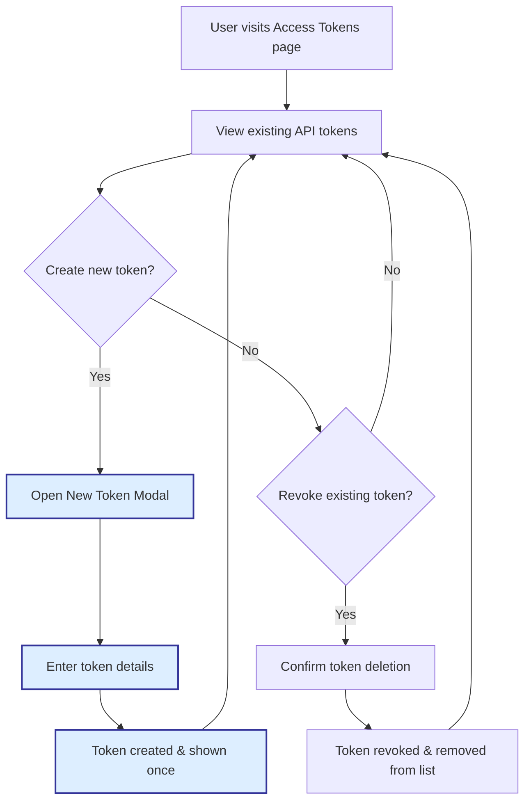

# Managing Users and API Access

Manage your Linkwarden user base and secure your data by controlling user roles and API access keys. This guide walks you through adding and removing users, understanding the roles that define user permissions, and managing API tokens that safeguard automated and external access.

---

## Workflow Overview

### What You Will Achieve
- Add new users and remove existing users from your Linkwarden instance
- Understand and assign user roles to control access and capabilities
- Create, manage, and revoke API keys to secure programmatic access
- Implement best practices for access control and account security

### Prerequisites
- Administrator or appropriate permission level to manage users and API access
- Access to the administrative settings area in Linkwarden
- Basic understanding of Linkwarden user roles and API usage

### Expected Outcome
You will confidently manage user accounts and API tokens to ensure proper access while protecting your data integrity and security.

### Estimated Time
Approximately 15–30 minutes to understand and configure users and API access.

### Difficulty Level
Intermediate — assumes knowledge of Linkwarden basics and administrative privileges.

---

## Managing Users

### Understanding User Roles
Linkwarden supports granular user roles to define what each user can access or modify:

- **Admin**: Full access to all settings, user management, and sensitive configurations.
- **Member**: Can add and manage their own bookmarks but limited access to administrative controls.
- **Guest or Restricted**: Minimal access, primarily view-only rights with no editing.

Ensure you assign roles carefully to maintain security and workflow integrity.

### Adding a New User

1. Navigate to the **User Management** section under your settings.
2. Click **Invite User** or **Add User**.
3. Enter the user’s email address or username.
4. Select the appropriate **User Role** from the dropdown.
5. Send the invitation or confirm the creation.

#### Expected Results
- The invited user receives an email to join or gain access.
- The user appears in your user list with the assigned role.

### Removing a User

1. Locate the user in the **User Management** list.
2. Select the user and click the **Remove** or **Delete** option.
3. Confirm the removal action.

#### Expected Results
- The user’s access is immediately revoked.
- Their existing bookmarks remain unless explicitly deleted.

<Tip>
Always audit user access periodically to ensure only authorized individuals have access.
</Tip>

---

## Managing API Access

For programmatic access and automation, Linkwarden uses API tokens that act as secure keys to authenticate external applications.

### What Are API Tokens?
API tokens represent secure credentials that allow external tools or scripts to interact with your Linkwarden instance while honoring your access policies.

### Viewing Existing API Tokens

1. Go to **Settings** > **Access Tokens**.
2. Review the list of tokens showing:
   - Token Name
   - Creation Date
   - Expiration Date
   - Whether the token is a permanent session or limited

### Creating a New API Token

<Steps>
<Step title="Open New Token Modal">
Click the **New Token** button in the Access Tokens section to open the token creation dialog.
</Step>
<Step title="Enter Token Details">
Provide a descriptive name for the token (e.g., 'Automation Bot' or 'Mobile App'). Optionally set an expiration date to limit token lifetime.
</Step>
<Step title="Create the Token">
Confirm and create the token. The system generates the key string and displays it once.
</Step>
<Step title="Securely Store the Token">
Copy the token securely. This token cannot be viewed again and must be kept safe.
</Step>
</Steps>

#### Expected Results
- A new API token is created and listed.
- The token string is shown once for copying.

### Revoking (Deleting) API Tokens

1. Identify the token you wish to revoke.
2. Click the delete (X) icon next to the token.
3. Confirm the revocation.

#### Expected Results
- The token is removed from the system and can no longer be used for authentication.

### Best Practices for API Token Security
- Use descriptive names for tokens to track their purpose.
- Set expiration dates whenever possible to limit long-term risk.
- Revoke tokens immediately if compromise is suspected.
- Avoid sharing tokens through insecure channels.

---

## Practical Tips

- **Automation Scope:** When using tokens for automation, create specific tokens per bot or service for tracking and revocation ease.
- **Session Tokens:** Tokens marked as 'permanent session' are tightly linked to user sessions; treat them as sensitive.
- **Audit Regularly:** Regularly review and prune inactive or redundant tokens and users.

<Tip>
Ensure your user roles align with your organization's security policies to avoid unauthorized data exposure.
</Tip>

## Troubleshooting & Common Issues

<AccordionGroup title="Common Challenges in User and API Token Management">
<Accordion title="User Not Receiving Invitation Email">
- Verify the email address entered is correct.
- Check your SMTP/email server configuration.
- Ask the user to check spam or junk folders.
- Resend the invitation if necessary.
</Accordion>
<Accordion title="Unable to Create or Delete Token in Demo Mode">
- The demo environment disables token management to prevent changes.
- Use a full installation or staging environment for testing.
</Accordion>
<Accordion title="API Token Not Working or Returns Authentication Error">
- Verify the token has not expired or been revoked.
- Ensure the token is copied correctly without extra spaces.
- Check that the token is used according to API documentation.
- Review user permissions connected to the token.
</Accordion>
</AccordionGroup>

---

## Example: Creating and Using an API Token

### Creating an API Token from the Web Interface

1. Navigate to **Settings > Access Tokens**.
2. Click **New Token**.
3. Enter **AutomationBot** as the token name.
4. Set expiry in 30 days.
5. Click **Create**.
6. Copy the generated token string safely.

### Using the Token

When calling the Linkwarden API, include the token in the header:

```http
Authorization: Bearer <Your-API-Token>
```

Replace `<Your-API-Token>` with the copied token string.

<Tip>
Test your API token with simple API calls to confirm it works before integrating into your automation workflows.
</Tip>

---

## Next Steps & Related Content

- **Inviting Members and Setting Permissions:** Learn more about inviting users and managing collection-level access in [Inviting Collaborators](https://docs.linkwarden.com/guides/collaboration-and-sharing/inviting-collaborators).
- **Authentication Overview:** Understand authentication methods and user identity management in [Authentication Overview](https://docs.linkwarden.com/security/auth-models-identity/auth-overview).
- **API Tokens & Access Control:** Deep dive into API token security and configuration in [API Tokens & Access Control](https://docs.linkwarden.com/security/data-privacy-protection/api-keys-access-tokens).

---

For further assistance, consult the [Troubleshooting & Common Setup Issues](https://docs.linkwarden.com/getting-started/initial-experience-validation/troubleshooting-common-issues) page or reach out to support.


---

## Reference: API Token Lifecycle Diagram



---