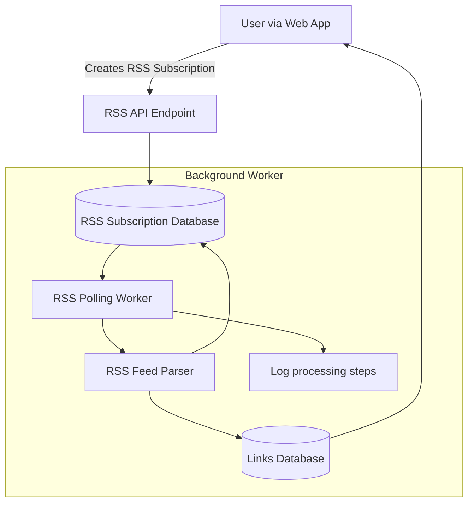

# Subscribing and Automating with RSS Feeds

Welcome to the guide on managing RSS feed subscriptions in Linkwarden. This page helps you leverage RSS feeds to automatically capture and preserve new articles, updates, and links, directly into your organized collections, boosting your knowledge capture workflows.

---

### 1. Understanding RSS Subscriptions in Linkwarden

**What this guide covers:**
- How to subscribe to RSS feeds
- Automating the saving and preservation of new RSS content
- Managing your RSS subscriptions efficiently through the Linkwarden web interface

RSS feeds are a powerful automation tool within Linkwarden that let you continuously gather new content updates from your favorite sources without manual effort. When a feed has new items, Linkwarden automatically creates links under your specified collections and preserves them, keeping your resources fresh and organized.

<Check>
By following this guide, you will be able to set up, automate, and manage RSS feeds so your saved links stay current and complete with minimal overhead.
</Check>

---

### 2. Prerequisites

Before subscribing and automating with RSS feeds, ensure:

- You have an active Linkwarden account and are signed in.
- You have at least one collection created where RSS links can be saved.
- Your Linkwarden server is configured to run the RSS polling worker (usually enabled by default).
- Optional but recommended: Familiarity with basic collections and their management.

---

### 3. Expected Outcome

By completing the steps in this guide, you will:

- Subscribe to one or multiple RSS feeds
- Automatically receive new feed items as saved links
- Organize RSS links under collections for easy retrieval
- Maintain up-to-date content without manual bookmarking

---

### 4. Time Estimate

The entire workflow can be completed in about 10-15 minutes, depending on how many feeds you wish to subscribe to.

---

### 5. Step-by-Step Instructions

<Steps>
<Step title="Access the RSS Subscriptions Page">
Navigate in the Linkwarden web app to **Settings** > **RSS Subscriptions**. This page lists all your current RSS subscriptions.

Expected result: You see the "RSS Subscriptions" header, description about the polling interval (default 60 minutes), and an option to add new subscriptions.
</Step>

<Step title="Add a New RSS Subscription">
Click the **New RSS Subscription** button.

- In the modal form, provide:
  - A friendly **name** for your feed (e.g., 'TechCrunch News').
  - The **URL** of the RSS feed you want to subscribe to.
  - The **collection** under which new RSS items should be saved.

- Submit the form.

Expected result: Your new subscription is saved, and Linkwarden immediately fetches the latest items from the feed to create links.
</Step>

<Step title="View and Manage Subscriptions">
Your subscribed RSS feeds display in a table with their:
- Name
- URL
- Assigned collection

To remove a subscription, click the delete button (X icon) next to the feed.

Confirm deletion when prompted.

Expected result: Removing a subscription stops future automated imports from that feed.
</Step>

<Step title="Automated Polling and Link Creation">
Behind the scenes, Linkwarden's background worker regularly polls all subscribed RSS feeds at the configured interval (default every 60 minutes).

When it detects new items:
- It verifies the user’s link limits.
- Automatically creates new links in the assigned collection.
- Updates the subscription's last-processed date.

Expected result: Your collection continually receives fresh links without manual intervention.
</Step>
</Steps>

<Tip>
The polling interval can be configured by an administrator using the environment variable `NEXT_PUBLIC_RSS_POLLING_INTERVAL_MINUTES`. By default, it is set to 60 minutes.
</Tip>

---

### 6. How it Works: Behind the Scenes

This diagram shows the flow of subscription and automated processing:



This flow shows how the user interacts with the UI to create subscriptions, the persistence in the database, and how the worker periodically fetches new feed items, creating links automatically.

---

### 7. Real-World Example

Imagine you want to subscribe to updates from a favorite tech news blog.

1. Copy the blog's RSS feed URL, for example: `https://techcrunch.com/feed/`
2. In Linkwarden RSS Subscriptions, click **New RSS Subscription**.
3. Name it "TechCrunch Updates".
4. Select your "Work" collection for organizing links related to work research.
5. Submit the form.

Within an hour (based on polling settings), new articles from TechCrunch will appear automatically as saved links inside your Work collection.

You can repeat this process for any RSS-feed-enabled source.

---

### 8. Best Practices and Tips

- **Choose meaningful names** for your RSS subscriptions so you can easily identify them.
- Assign RSS subscriptions to collections that logically group the content.
- Avoid subscribing to feeds you rarely use to reduce clutter.
- Monitor your link limit, as users have a maximum number of saved links per user to avoid overuse.
- If removing a subscription, remember this only stops new items; existing links remain in your collections.
- Use Linkwarden's tagging features to further refine organization after automated imports.

---

### 9. Troubleshooting

<AccordionGroup title="Common Issues in RSS Subscription Management">
<Accordion title="The RSS feed URL is invalid or not loading">
- Verify the RSS URL in your browser or an RSS reader.
- Ensure the URL starts with `http://` or `https://` and points to a valid RSS XML feed.
- Linkwarden logs errors for unreachable feeds; check worker logs for details.
</Accordion>

<Accordion title="New items are not appearing frequently">
- Check the polling interval configured in your instance (default: 60 min).
- The feed itself may update infrequently.
- Ensure the RSS subscription's `lastBuildDate` or latest pubDate is recent.
- Avoid deleting then recreating the same feed too quickly; it may skip already seen items.
</Accordion>

<Accordion title="Reached RSS subscription or link limits">
- The platform sets a maximum number of allowed RSS subscriptions and links per user.
- If limits are reached, new items will be skipped.
- Consider cleaning up unused subscriptions or links.
- Contact your administrator to increase limits if self-hosted.
</Accordion>

<Accordion title="Failed to delete RSS subscriptions">
- Confirm you have permission to delete the subscription (you must be the owner).
- Network or server errors can cause deletion to fail; retry after refreshing the page.
</Accordion>
</AccordionGroup>

---

### 10. Next Steps & Related Documentation

- After setting up RSS feeds, explore **Organizing Links: Collections & Tags** to maximize your content management.
- Learn about **Preserving Pages: Archive & Reader View** to complement your automated link saving with full content preservation.
- For API-based automation or integrations, see **RSS Feed Subscription Management (API Reference)**.
- New to Linkwarden? Begin with the **Quickstart: Adding and Preserving Your First Link** guide.

---

### Code Snippet: Adding a New RSS Subscription via API

If you want to automate adding RSS subscriptions programmatically, here is a simplified example of its POST structure:

```json
{
  "name": "TechCrunch Updates",
  "url": "https://techcrunch.com/feed/",
  "collectionId": 123,
  "collectionName": "Work"
}
```

Use this payload to POST to `/api/v1/rss` with a valid authenticated session.

---

### Summary

By subscribing to RSS feeds in Linkwarden, you automate continuous link capture and preservation from your favorite online sources. Managed through a simple web interface or API, this feature keeps your collections fresh with minimal effort, supporting your knowledge workflows effectively.

---

For more detailed workflows, visit the following related guides:
- [Organizing Links: Collections & Tags](https://docs.linkwarden.com/guides/getting-started/collections-and-tags-basics)
- [Preserving Pages with Archive & Reader View](https://docs.linkwarden.com/guides/getting-started/preserving-and-reading-links)
- [RSS Feed Subscription Management API](https://docs.linkwarden.com/api-reference/advanced-features/rss-feed-management)

For troubleshooting or advanced automation, also consult the [Troubleshooting & Common Setup Issues](https://docs.linkwarden.com/getting-started/initial-experience-validation/troubleshooting-common-issues) guide.

---

Thank you for using Linkwarden to automate your knowledge capture!
