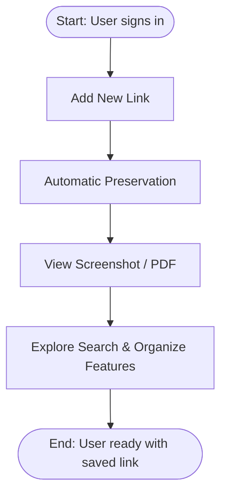

# Your First Saved Link: Quick Start

Welcome to Linkwarden! This guide helps you get started by signing in, adding your very first link, and exploring core features like preserved screenshots and PDFs. Whether you prefer the web app or mobile experience, you'll quickly see the power of Linkwarden in safeguarding and organizing your important web content.

---

## 1. Workflow Overview

### What This Guide Does
This guide walks you through the steps to:
- Access Linkwarden via the web or download the mobile app
- Sign in securely to your Linkwarden instance
- Add your first link (bookmark or webpage) to your collection
- View preserved content formats such as screenshots and PDFs
- Get oriented with core link features and navigation

### Prerequisites
- An active Linkwarden account or self-hosted instance
- Internet access for app download or web access
- Basic familiarity with saving bookmarks/links

### Expected Outcome
By completing this guide, you will have:
- Successfully signed into Linkwarden
- Added and saved your first link
- Viewed how Linkwarden automatically preserves web content
- Oriented yourself with navigation for managing saved links

### Time Estimate
Approximately 10–15 minutes for a smooth first-time setup and link addition.

### Difficulty Level
Beginner — designed for first-time users without prior exposure.

---

## 2. Step-by-Step Instructions

### Step 1: Access Linkwarden

#### Using the Web App
1. Navigate to your Linkwarden URL (e.g., https://cloud.linkwarden.app or your self-hosted address).
2. Click the Sign In button.
3. Enter your username and password to log in.

#### Using the Mobile App
1. Download the Linkwarden app from your device’s app store or your organization’s distribution method.
2. Open the app and enter your credentials.
3. Sign in to access your Linkwarden dashboard.

##### Expected Result
You should reach the Linkwarden dashboard or your links overview page after authentication.

### Step 2: Add Your First Link

#### Using the Web App
1. On the dashboard or main links page, click the **+ New Link** button.
2. Enter the URL of the webpage you want to save.
3. Click **Save to Linkwarden**.

#### Using the Mobile App
1. From the Dashboard, tap the **+** icon at the top.
2. Select **New Link** from the menu.
3. In the input box, paste or type the webpage URL.
4. Tap **Save to Linkwarden**.

##### Expected Result
Your link appears in your list of saved links with a thumbnail preview once preserved.

### Step 3: Explore Preserved Formats

Linkwarden automatically preserves the web page content in key formats:
- **Screenshot**: A visual snapshot of the page when saved.
- **PDF**: A portable version of the page for offline reading.

#### How to View
1. Click or tap the saved link in your links list.
2. Select the desired preservation format (e.g., screenshot, PDF) to open.

##### Expected Result
You can view a high-quality, preserved snapshot or PDF even if the original webpage changes or disappears.

### Step 4: Navigate Core Features

- **Search Bar**: Use the search bar at the top of your links list to find saved content quickly.
- **Collections & Tags**: Organize links into collections or tags for easy retrieval. (Setup available in advanced sections.)
- **Edit Link Details**: Update link name, description, or collection via the edit panel.

##### Tips
- Use relevant names and descriptions to improve searchability.
- Start tagging links as your library grows to keep organized.

---

## 3. Practical Examples

### Adding a Research Article
1. Copy the article URL.
2. Add the link using the steps above.
3. View the preserved PDF to read offline.
4. Tag as "Research" or add to a "Work" collection.

### Bookmarking a Favorite Blog
1. Save the blog's homepage URL.
2. View the screenshot for a quick visual reference.
3. Add descriptive notes to remember why this blog is valuable.

---

## 4. Troubleshooting & Tips

### Common Issues

- **Cannot Log In**
  - Verify your username and password.
  - Ensure you are using the correct Linkwarden instance URL.
  - Try resetting your password if needed.

- **Link Fails to Save**
  - Double-check the URL format (include https://).
  - Check your internet connection.
  - If the domain is blocked or inaccessible, preservation might fail.

- **Preserved Screenshots or PDFs Not Showing**
  - Preservation processes may take a few moments. Refresh or check back shortly.
  - Some websites block snapshotting; in such cases, preservation is limited.

### Best Practices
- Always verify saved links immediately after addition to catch errors.
- Use meaningful names and descriptions to enhance link management.
- Gradually build collections and tags to improve organization.

### Performance Notes
- Bulk link saving may slow preservation; save links individually when starting out.
- Mobile app sync ensures offline access but requires occasional connectivity.

---

## 5. Next Steps & Related Content

### What’s Next?
- Explore [Organizing Links: Collections & Tags](https://docs.linkwarden.app/guides/getting-started/collections-and-tags-basics) to manage your growing library.
- Learn about [Preserving Pages: Archive & Reader View](https://docs.linkwarden.app/guides/getting-started/preserving-and-reading-links) for deeper content capture.
- Dive into [Inviting Members and Setting Permissions](https://docs.linkwarden.app/guides/collaboration-and-sharing/inviting-collaborators) to collaborate effectively.

### Helpful Links
- [System Requirements](https://docs.linkwarden.app/getting-started/prerequisites-installation/system-requirements)
- [First Run Setup](https://docs.linkwarden.app/getting-started/prerequisites-installation/first-run-setup)
- [Troubleshooting & Common Setup Issues](https://docs.linkwarden.app/getting-started/initial-experience-validation/troubleshooting-common-issues)
- [Feature Overview](https://docs.linkwarden.app/overview/core-concepts-and-architecture/feature-overview)

---

## Visual Summary of the Quickstart Flow

---

## Final Tips
- Keep your credentials secure and use strong passwords.
- Regularly back up your Linkwarden data if self-hosting.
- Explore browser extensions and mobile apps for seamless link saving.

Welcome to a more reliable, organized way to save and preserve web content with Linkwarden!
