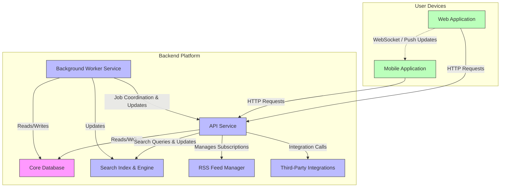

# System Architecture Overview

Gain a clear, high-level view of Linkwarden's system architecture presented through a detailed Mermaid diagram. This page offers a concise visual summary of the core components powering Linkwarden's web, mobile, and worker clients, as well as the backend services including databases, search infrastructure, and integration channels such as APIs, RSS feeds, and third-party platforms.

---

## Why This Matters to You

Understanding the system architecture simplifies how you navigate Linkwarden’s ecosystem, providing clarity on data flow and component responsibilities. Whether you are a developer, administrator, or advanced user, this overview helps you troubleshoot, extend, or integrate Linkwarden efficiently by visualizing how each piece fits together.

---

## At a Glance: What You’ll See

This system overview highlights:

- **Multi-Platform Clients:** Web and mobile applications designed to deliver a seamless user experience.
- **Background Workers:** Services handling asynchronous tasks like link archiving and search indexing.
- **Core Data Stores:** The primary database storing links, collections, tags, and user data.
- **Search Infrastructure:** Dedicated components ensuring fast and accurate full-text search.
- **Integration Endpoints:** APIs, RSS feed subscriptions, and third-party platform connectors.

---

## How the System Works

Linkwarden's architecture is crafted for modular interaction across platforms:

- **User Interfaces:** The web and mobile apps serve as entry points where users save, organize, and access their links.
- **Backend Processing:** Workers perform timely background jobs such as generating archives, refreshing data, and updating search indexes to keep user content safe and searchable.
- **Data Persistence:** All content, metadata, and user preferences are reliably stored and managed in the central database.
- **External Integrations:** APIs and RSS feeds allow automated link saving and content updates from external services.

This layered approach ensures a fast, reliable, and flexible experience.

---

## Architecture Diagram

---

## Practical Understanding Through Data Flow

1. **Saving a Link:** A user adds a link via web or mobile app.
2. **API Processing:** The API service authenticates, validates, and stores the link in the database.
3. **Background Operations:** The worker service triggers archiving tasks and updates the search index.
4. **Search & Retrieval:** When the user searches, the API queries the search service to deliver fast, relevant results.
5. **RSS and Integrations:** New links from RSS feeds or third-party integrations flow through API to the database, making your collections continually up to date.

---

## Tips for Users and Developers

- **For Users:** Knowing which components handle your requests can help you troubleshoot issues like slow searches or delayed content updates.
- **For Developers:** This architecture provides a foundation to build on new features, integrations, or optimize performance.
- **For Administrators:** Understanding component roles aids system monitoring, maintenance, and scaling strategies.

---

## Troubleshooting Common Concerns

- **Delayed Link Archiving:** Background worker might be busy or paused; confirm worker service health.
- **Search Results Not Updating:** Check Search Service indexing and synchronization with the database.
- **API Response Issues:** Validate API service availability and authentication tokens.

If you encounter issues, tracing through the data flow as shown in the architecture can isolate root causes quickly.

---

## Next Steps

- Explore the [Feature Overview](../feature-overview) to see how architectural components translate into user functionality.
- Visit [Core Concepts & Terminology](../core-concepts-terminology) to deepen your understanding of key data entities managed by these components.
- If integrating or extending, review [Integrations & API Access](../../integrations-and-extensibility/integrations) for detailed gateway information.

---

This page serves as your doorway to mastering the Linkwarden system, enabling productive use, smooth troubleshooting, and confident customization.

---

[Return to Overview Index](../)
