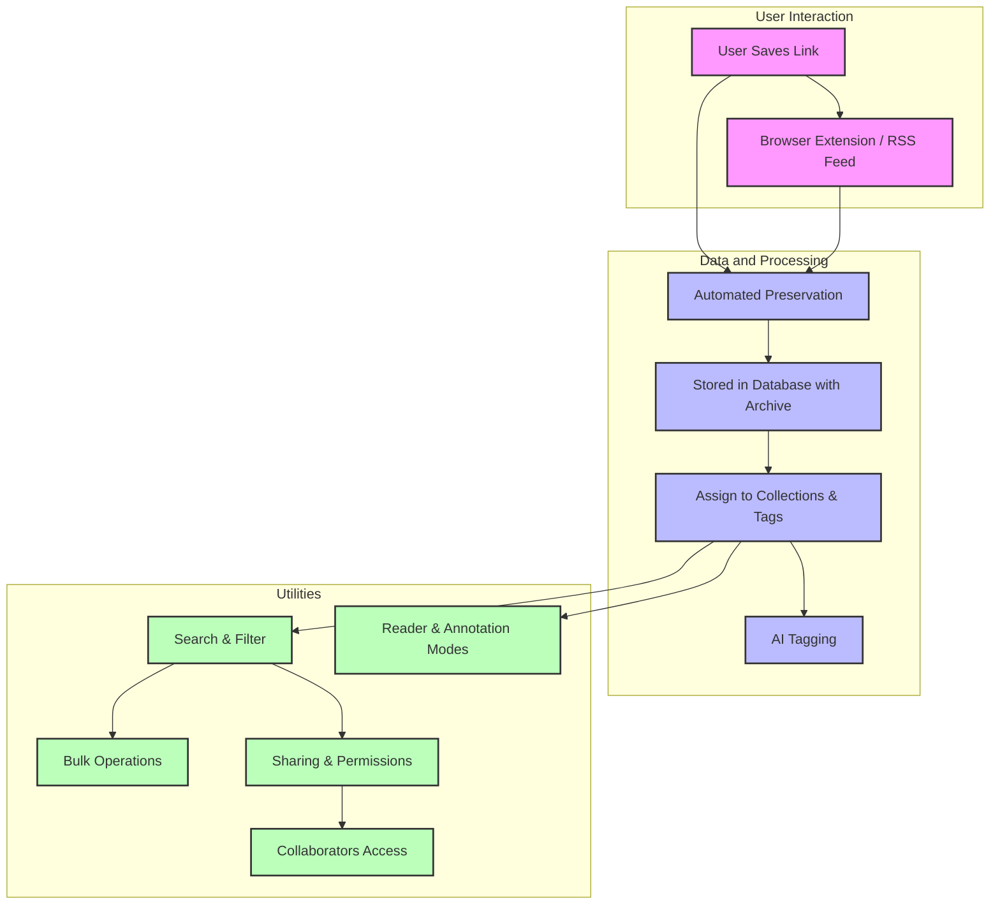

# Feature Overview

Discover the core capabilities that make Linkwarden an essential tool for managing, preserving, and collaborating on valuable web content. This page presents a clear perspective on Linkwarden’s powerful features — from automated content preservation to advanced organizing, annotation, sharing, and integration options — aligned with your workflows for knowledge management, team projects, or personal productivity.

---

## Unlocking the Power of Persistent Web Content

Linkwarden automates the preservation of web content to protect against link rot, provides intuitive ways to organize your knowledge, and enhances collaboration through sharable collections and AI-driven metadata. By integrating reader modes, bulk operations, and multiple extensions such as browser tooling, RSS feeds, and SSO, Linkwarden delivers a seamless experience across devices and teams.

### What You Can Achieve with Linkwarden Features:

- **Never lose access to your critical web resources** thanks to powerful, automated preservation and archival modes.
- **Organize links effortlessly** using collections, tags, and AI-assisted smart tagging.
- **Collaborate with teams** by sharing collections securely and managing permissions.
- **Find what matters fast** with full-text search, filtering, and bulk operations.
- **Automate and extend workflows** through RSS subscriptions, browser extensions, and single sign-on integrations.

---

## Core Features & How They Fit in Your Workflow

### 1. Automated Web Content Preservation

Linkwarden automatically captures and archives content when you save a link, ensuring you can revisit the exact page even if the original goes offline or changes. Preservation modes include full-page archiving and customizable snapshot formats to suit your needs. 

*Scenario:* Imagine bookmarking a research article or tutorial today and confidently accessing its full content months or years later without worrying about broken links or paywalls.

### 2. Collaborative Organizing with Collections and Tags

Group saved links into thematic collections that serve as shared knowledge bases or project folders. Use tags — including AI-generated smart tags — to classify links dynamically and enhance discovery.

*Example:* Your team curates a "Project Alpha" collection with research papers, news updates, and relevant blogs, all easily searched and filtered using tags like "AI," "data analysis," or "strategies."

### 3. Reader and Annotation Modes

Enjoy distraction-free reading inside Linkwarden’s reader view, stripping away clutter from saved pages. Annotate key insights directly on preserved pages to highlight important points and collaborate asynchronously.

*Tip:* When reviewing lengthy documents, use annotations to flag critical sections for your team or for future reference.

### 4. Sharing and Access Controls

Easily share collections or individual links publicly or privately. Configure granular permissions to control collaborator roles—allowing specific users to create, update, or delete content.

*Use Case:* An educator shares a curated reading list with students, enabling them to add comments but restricting editing rights, maintaining content integrity.

### 5. Powerful Search with Bulk Operations

Navigate your growing library with full-text search and filters by date, tag, collection, or preservation status. Perform bulk actions like tagging, archiving, or deleting multiple links to maintain an organized workspace.

*Scenario:* Quickly locate all saved links tagged "mindfulness" and perform batch archive updates as new content becomes available.

### 6. AI Tagging and Metadata Enrichment

Let Linkwarden’s AI analyze saved links to generate context-aware tags, boosting discovery and reducing manual effort. This feature helps reveal implicit themes and relationships across your content.

### 7. Integrations: SSO, Browser Extensions, and RSS

Linkwarden connects smoothly with your existing tools:

- **SSO Integration:** Access Linkwarden securely using your organization’s identity provider.
- **Browser Extensions:** Save links and preserve content directly from your browser without switching context.
- **RSS Feed Subscription:** Automate link saving by subscribing to RSS feeds from favorite sites, keeping you updated effortlessly.

*Practical Tip:* Combine RSS feeds with collections to auto-organize incoming content for research or news monitoring.

---

## How Linkwarden Features Streamline Your Experience

By layering these capabilities, Linkwarden transforms how you capture, curate, and collaborate on web content. The automated preservation frees you from manual archiving; organizing tools make retrieval intuitive; collaboration features foster teamwork without email chains; and integrations bring Linkwarden into your daily workflow.

Whether you're an individual knowledge worker safeguarding valuable reading material or a team stewarding collective resources over time, the feature set supports your productivity and information sovereignty with measurable efficiency gains.

---

## Getting Started Preview

Begin your journey by adding your first link and exploring how Linkwarden preserves and organizes it. You’ll quickly see how collections and tags help structure information, while the reader and annotation modes enhance comprehension and follow-up.

From there, explore collaboration features, bulk operations for streamlined management, and integrate browser extensions or RSS feeds to automate your workflow.

For detailed steps on initial use, visit our [Quickstart: Adding and Preserving Your First Link](https://docs.linkwarden.com/guides/getting-started/quick-start-workflow).

---

## Visual Workflow: Linkwarden Core Features Interaction

---

For a comprehensive understanding of Linkwarden’s core architecture and concepts, consider reading sections on [Core Concepts & Terminology](https://docs.linkwarden.com/overview/core-concepts-and-architecture/core-concepts-terminology) and the [System Architecture Overview](https://docs.linkwarden.com/overview/core-concepts-and-architecture/architecture-overview).

---

#### Need Help?
If you encounter questions about how features behave or want guidance on optimizing your workflows, our [Troubleshooting & Common Setup Issues](https://docs.linkwarden.com/getting-started/initial-experience-validation/troubleshooting-common-issues) and [FAQ](https://docs.linkwarden.com/faq/getting-started-and-general-faq/what-is-linkwarden) pages offer in-depth support.

---

Unlock the full potential of your saved content with Linkwarden’s feature-rich platform tailored to your needs and collaborative ambitions.

---

*Explore other key documentation areas to expand your mastery and integrate Linkwarden fully into your content management ecosystem.*