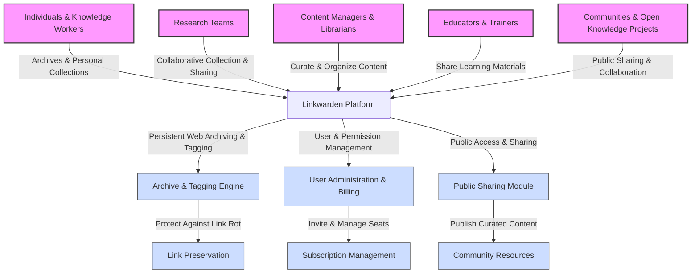

# Target Audience & Use Cases

## Discover Who Benefits Most from Linkwarden

Linkwarden is designed to empower a wide range of users and communities who need lasting, organized, and collaborative access to web resources. Whether you are an individual seeking to archive critical information, a research team coordinating knowledge collection, a content manager curating collections for your organization, an educator sharing curated learning materials with students, or a community building a public library of invaluable web content, Linkwarden is built for you.

### Key Audiences

- **Individuals & Knowledge Workers:** Save, organize, and preserve your favorite web content for lifelong access. Avoid losing important references and maintain a personal archive of insights, articles, and tools.

- **Research Teams:** Collaborate seamlessly on web collections. Share sources, analyze findings together, and ensure critical research data is preserved beyond the lifespan of a webpage.

- **Content Managers & Librarians:** Organize and maintain curated link collections with intelligent tagging and archival features. Manage team access and publication workflows efficiently.

- **Educators & Trainers:** Build tailored collections of resources, lesson links, and research archives. Share them publicly or within specific groups to enhance teaching and learning.

- **Communities & Open Knowledge Projects:** Crowdsource and maintain community-curated collections that resist link rot and preserve cultural, technical, or topical knowledge.

## Real Scenarios Illustrating Linkwarden's Value

### Collaborative Research and Knowledge Sharing
Imagine a research team investigating emerging trends in renewable energy technologies. They use Linkwarden to collect scientific articles, regulatory documents, and news reports. Each member adds to shared collections, tags entries by topic and methodology, and comments on annotations. Because Linkwarden preserves snapshots of each link, the team can trust that critical sources remain accessible despite website changes or removals.

### Curating Public Knowledge Bases
A nonprofit dedicated to health literacy curates collections of verified health information, local clinic resources, and educational content. They share these collections publicly and update them collaboratively. Linkwarden’s public sharing options and archiving features help them serve their community reliably, even as external websites evolve or disappear.

### Personal Knowledge Management
An individual who enjoys deep, ongoing learning across topics like cooking, technology, and productivity uses Linkwarden to organize bookmarks, notes, and archived pages. They create tailored collections that they can access everywhere and share selectively with friends or colleagues.

### Team Content Moderation & Subscription Management
Admins managing Linkwarden subscriptions can invite team members, assign permission levels, and monitor user activity via the billing and user administration settings. This streamlines seat management and provides clear oversight of who can contribute or consume shared resources.

## Why Choose Linkwarden for These Use Cases?
- **Persistent Web Access:** Prevent link rot from disrupting your knowledge base by archiving pages automatically.

- **Flexible Collaboration:** Invite users easily, set granular permissions, and work together fluidly.

- **Organized Collections with Tags:** Tailor your link grouping with intuitive tags and smart search.

- **Self-Hosting & Data Sovereignty:** Keep your data under your control with secure, self-hosted deployment options.

- **Public Sharing & Curation:** Publish collections for wider audience engagement without compromising your private workspaces.

## Next Steps
Explore related documentation to deepen your expertise:

- [What is Linkwarden?](./what-is-linkwarden) — Understand the product’s fundamental mission.
- [Core Value Proposition](./product-value-prop) — Learn why Linkwarden stands out.
- [Inviting Members and Setting Permissions](../../guides/collaboration-and-sharing/inviting-collaborators) — Manage collaboration effectively.
- [Sharing Collections or Links Publicly](../../guides/collaboration-and-sharing/public-sharing) — Reach community audiences.

---

## Tips for Success

- Start small with a personal collection to experience Linkwarden’s power before scaling to teams.
- Use descriptive tags to maintain an efficient, searchable archive.
- Leverage public sharing to showcase curated knowledge and increase impact.
- Regularly review user access and subscription settings to optimize collaboration costs.

## Common Pitfalls to Avoid

- Don’t rely solely on external links; always archive to protect against content loss.
- Avoid overlapping user permissions that complicate administration; assign clear roles.
- Do not ignore onboarding guides for new collaborators; smooth invitations improve adoption.

---

### Summary
This page defines the ideal users and practical scenarios where Linkwarden delivers critical value, from personal to community-wide knowledge management. It frames how different audiences, such as researchers, educators, and content managers, can benefit from Linkwarden’s persistent archiving, collaboration features, and flexible sharing options.

---

## Frequently Asked Questions

<AccordionGroup title="FAQs about Target Audience & Use Cases">
<Accordion title="Who is Linkwarden made for?">
Linkwarden serves individuals, research teams, educators, content managers, and community groups looking to save, organize, and preserve web knowledge collaboratively and reliably.
</Accordion>
<Accordion title="How can teams benefit from Linkwarden?">
Teams gain from shared collections, invited user roles, permission settings, and subscription management designed to streamline collaboration and maintain data integrity.
</Accordion>
<Accordion title="Can Linkwarden be used for public sharing?">
Yes. Linkwarden supports public sharing of collections or links, enabling communities and organizations to build open libraries of lasting web content.
</Accordion>
<Accordion title="Does Linkwarden support self-hosting?">
Absolutely. Self-hosting ensures data sovereignty and control, appealing especially to organizations with strict security or privacy requirements.
</Accordion>
</AccordionGroup>

# Visualizing Key User Groups & Use Cases

---

For detailed workflows and practical how-tos, visit related pages on collaboration, user administration, and public sharing under the Guides section.

---

*Last updated: 2024-06*

---